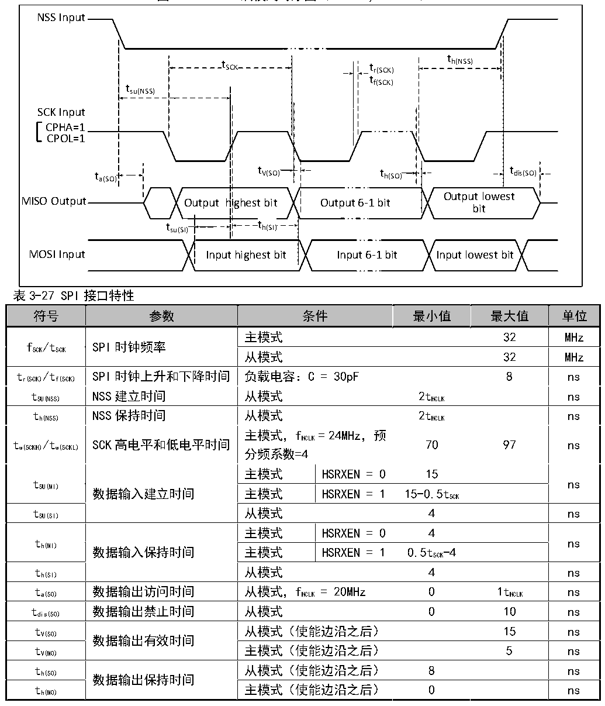

<!-- source-page: 47 -->

[← p.46](0046.md) · [index](../README.md) · [PDF p.47](https://ch32-riscv-ug.github.io/CH32L103/datasheet_zh/CH32L103DS0.PDF#page=47) · [p.48 →](0048.md)

<!-- header: CH32L103/M103数据手册 https://wch.cn -->

图3-11-2 SPI从模式时序图（CPHA=1，CPOL=1）  
 <!-- rendered from the PDF; verify at https://ch32-riscv-ug.github.io/CH32L103/datasheet_zh/CH32L103DS0.PDF#page=47 -->

🖼 Text parsed from the figure above

NSS Input  
t  
t SCK t r(SCK) h(NSS)  
tf(SCK)  
tsu(NSS)  
SCK Input  
CPHA=1  
CPOL=1  
t a(SO) t V(SO) t h(SO) t dis(SO)  
Output lowest  
MISO Output Output highest bit Output 6-1 bit  
bit  
t su(SI)  
t h(SI)  th(SI)  
MOSI Input Input highest bit Input 6-1 bit Input lowest bit  

> ⚠ Table extraction recorded 4 issue(s) (overlapping merged cells); verify against [the PDF, p.47](https://ch32-riscv-ug.github.io/CH32L103/datasheet_zh/CH32L103DS0.PDF#page=47).

<!-- p47-table-003 (table-3-27@1) -->
<table><caption>表3-27 SPI接口特性</caption><tr><th>符号</th><th>参数</th><th colspan="2">条件</th><th>最小值</th><th>最大值</th><th>单位</th></tr><tr><td rowspan="2" style="text-align:left">f /t SCK SCK</td><td rowspan="2">SPI时钟频率</td><td rowspan="2" colspan="2" style="text-align:left">主模式从模式</td><td></td><td>32</td><td>MHz</td></tr><tr><td></td><td>32</td><td>MHz</td></tr><tr><td style="text-align:left">t /t r(SCK) f(SCK)</td><td>SPI时钟上升和下降时间</td><td colspan="2">负载电容：C = 30pF</td><td></td><td>8</td><td>ns</td></tr><tr><td style="text-align:left">t SU(NSS)</td><td>NSS建立时间</td><td colspan="2">从模式</td><td style="text-align:left">2t HCLK</td><td></td><td>ns</td></tr><tr><td style="text-align:left">t h(NSS)</td><td>NSS保持时间</td><td colspan="2">从模式</td><td style="text-align:left">2t HCLK</td><td></td><td>ns</td></tr><tr><td style="text-align:left">t /t w(SCKH) w(SCKL)</td><td>SCK高电平和低电平时间</td><td colspan="2" style="text-align:left">主模式，f = 24MHz，预HCLK分频系数=4</td><td>70</td><td>97</td><td>ns</td></tr><tr><td rowspan="2" style="text-align:left">t SU(MI)</td><td rowspan="3">数据输入建立时间</td><td rowspan="3" colspan="2" style="text-align:left">主模式 HSRXEN = 0 主模式 HSRXEN = 1从模式</td><td>HSRXEN = 0</td><td>15</td><td></td><td rowspan="2">ns</td></tr><tr><td>HSRXEN =</td><td style="text-align:left">15-0.5t SCK</td><td></td></tr><tr><td style="text-align:left">t SU(SI)</td><td>4</td><td></td><td>ns</td></tr><tr><td rowspan="2" style="text-align:left">t h(MI)</td><td rowspan="3">数据输入保持时间</td><td rowspan="3" colspan="2" style="text-align:left">主模式 HSRXEN = 0 主模式 HSRXEN = 1从模式</td><td>HSRXEN = 0</td><td>4</td><td></td><td rowspan="2">ns</td></tr><tr><td>HSRXEN = 1</td><td style="text-align:left">0.5t -4SCK</td><td></td></tr><tr><td style="text-align:left">t h(SI)</td><td>4</td><td></td><td>ns</td></tr><tr><td style="text-align:left">t a(SO)</td><td>数据输出访问时间</td><td colspan="2" style="text-align:left">从模式，f = 20MHz HCLK</td><td>0</td><td style="text-align:left">1t HCLK</td><td>ns</td></tr><tr><td style="text-align:left">t dis(SO)</td><td>数据输出禁止时间</td><td colspan="2">从模式</td><td>0</td><td>10</td><td>ns</td></tr><tr><td style="text-align:left">t V(SO)</td><td rowspan="2">数据输出有效时间</td><td rowspan="2" colspan="2" style="text-align:left">从模式（使能边沿之后） 主模式（使能边沿之后）</td><td></td><td>15</td><td>ns</td></tr><tr><td style="text-align:left">t V(MO)</td><td></td><td>5</td><td>ns</td></tr><tr><td style="text-align:left">t h(SO)</td><td rowspan="2">数据输出保持时间</td><td rowspan="2" colspan="2" style="text-align:left">从模式（使能边沿之后） 主模式（使能边沿之后）</td><td>8</td><td></td><td>ns</td></tr><tr><td style="text-align:left">t h(MO)</td><td>0</td><td></td><td>ns</td></tr></table>

### 3.3.16 USB接口特性

<!-- p47-table-004 (table-3-28@1) pages 47-48 -->
<table><caption>表3-28 USB I/O端口特性</caption><tr><th>符号</th><th>参数</th><th>条件</th><th>最小值</th><th>典型值</th><th>最大值</th><th>单位</th></tr><tr><td style="text-align:left">VDD</td><td>USB工作电压</td><td style="text-align:left">根据V 电压选择USB参数DD</td><td>3.0</td><td></td><td>3.6</td><td>V</td></tr><tr><td style="text-align:left">VSE</td><td>单端接收器阈值</td><td>额定电压</td><td>1.2</td><td></td><td>1.9</td><td>V</td></tr><tr><td style="text-align:left">VOL</td><td>静态输出低电平</td><td></td><td></td><td></td><td>0.3</td><td>V</td></tr><tr><td style="text-align:left">VOH</td><td>静态输出高电平</td><td></td><td>2.8</td><td></td><td></td><td>V</td></tr><tr><td style="text-align:left">VBC_REF</td><td>BC比较器参考电压</td><td></td><td></td><td>0.4</td><td></td><td>V</td></tr><tr><td style="text-align:left">VBC_SRC</td><td>BC协议输出电压</td><td></td><td></td><td>0.6</td><td></td><td>V</td></tr></table>

<!-- image: p47-draw-image-00001 bbox=[502.8, 786.36, 522.24, 796.68] -->
<!-- footer: V2.1 45 -->
