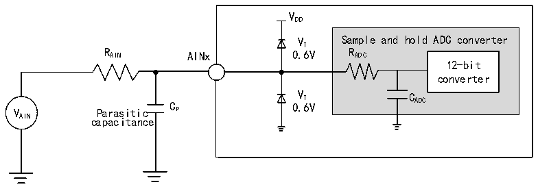

<!-- source-page: 49 -->

[← p.48](0048.md) · [index](../README.md) · [PDF p.49](https://ch32-riscv-ug.github.io/CH32L103/datasheet_zh/CH32L103DS0.PDF#page=49) · [p.50 →](0050.md)

<!-- header: CH32L103/M103数据手册 https://wch.cn -->
公式：最大RAIN  
<!-- image: p49-draw-image-00002 bbox=[209.28, 75.6, 365.88, 99.96] -->
上述公式用于决定最大的外部阻抗，使得误差可以小于1/4 LSB。其中N=12(表示12位分辨率)。  

<!-- p49-table-001 (table-3-30@1) -->
<table><caption>表3-30 fADC= 14MHz时的最大RAIN</caption><tr><th style="text-align:left">T(周期) S</th><th style="text-align:left">t (us) S</th><th style="text-align:left">最大R (kΩ) AIN</th></tr><tr><td>1.5</td><td>0.11</td><td>1.2</td></tr><tr><td>7.5</td><td>0.54</td><td>12.3</td></tr><tr><td>13.5</td><td>0.96</td><td>23.3</td></tr><tr><td>28.5</td><td>2.04</td><td>50</td></tr><tr><td>41.5</td><td>2.96</td><td>75</td></tr><tr><td>55.5</td><td>3.96</td><td>无限制</td></tr><tr><td>71.5</td><td>5.11</td><td>无限制</td></tr><tr><td>239.5</td><td>17.1</td><td>无限制</td></tr></table>

<!-- p49-table-002 (table-3-31@1) -->
<table><caption>表3-31 ADC误差</caption><tr><th>符号</th><th>参数</th><th>条件</th><th>最小值</th><th>典型值</th><th>最大值</th><th>单位</th></tr><tr><td>ET</td><td>整体误差</td><td rowspan="3" style="text-align:left">f = 14MHz, ADC R &lt; 10kΩ, AIN V = 3.3V, DD 15mV＜ V ＜(V -15mV) AIN DD测量结果经过校准</td><td></td><td>±3</td><td>±8</td><td rowspan="3">LSB</td></tr><tr><td>ED</td><td>微分非线性误差</td><td></td><td>±2</td><td>±5</td></tr><tr><td>EL</td><td>积分非线性误差</td><td></td><td>±3</td><td>±5</td></tr></table>

注：以上均为设计参数保证。  

图3-12 ADC典型连接图  
 <!-- rendered from the PDF; verify at https://ch32-riscv-ug.github.io/CH32L103/datasheet_zh/CH32L103DS0.PDF#page=49 -->

🖼 Text parsed from the figure above

VDD  
VT Sample and hold ADC converter  
R AIN AINx 0.6V R ADC  
12-bit  
converter  
V Parasitic C P 0 V . T 6V C ADC  
AIN capacitance  

Cp 表示PCB与焊盘上的寄生电容（大约5pF），可能与焊盘和PCB布局质量有关。较大的Cp 数值将  
降低转换精度，解决办法是降低fADC 值。  
<!-- image: p49-draw-image-00001 bbox=[502.8, 786.36, 522.24, 796.68] -->
<!-- footer: V2.1 47 -->
