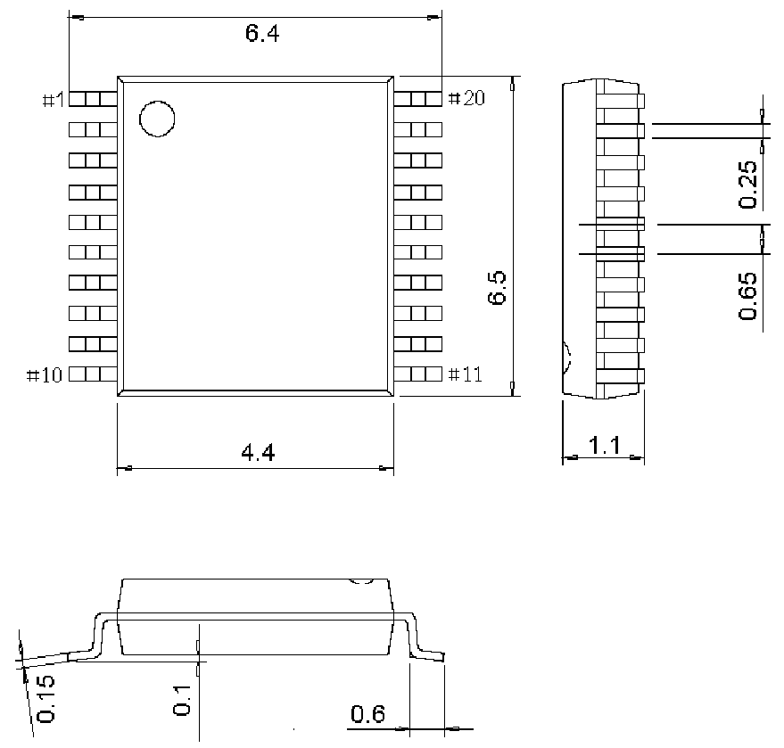

<!-- source-page: 57 -->

[← p.56](0056.md) · [index](../README.md) · [PDF p.57](https://ch32-riscv-ug.github.io/CH32L103/datasheet_zh/CH32L103DS0.PDF#page=57) · [p.58 →](0058.md)

<!-- header: CH32L103/M103数据手册 https://wch.cn -->

## 4.5 TSSOP20封装

 <!-- p57-draw-image-00002 rendered from the PDF -->

<!-- image: p57-draw-image-00001 bbox=[502.8, 779.28, 522.24, 789.6] -->
<!-- footer: V2.1 55 -->
