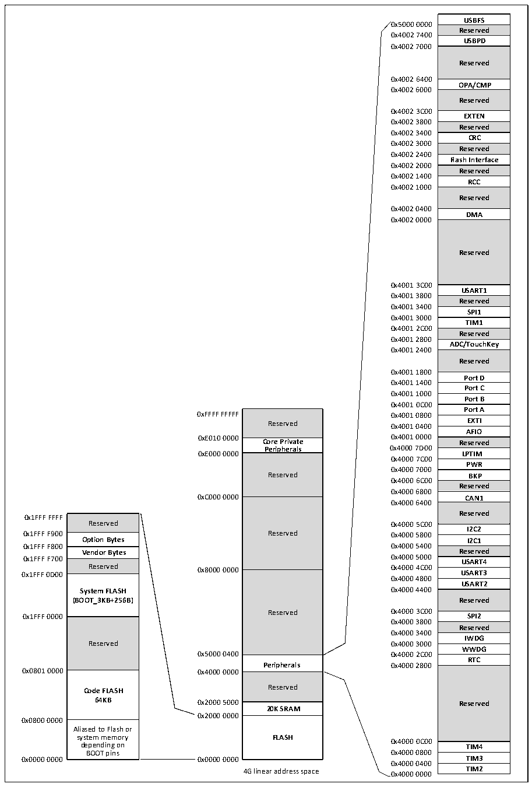

<!-- source-page: 6 -->

[← p.5](0005.md) · [index](../README.md) · [PDF p.6](https://ch32-riscv-ug.github.io/CH32L103/datasheet_en/CH32L103RM.PDF#page=6) · [p.7 →](0007.md)

<!-- header: CH32L103 Reference Manual https://wch-ic.com -->

Figure 1-2 Storage image  
 <!-- rendered from the PDF; verify at https://ch32-riscv-ug.github.io/CH32L103/datasheet_en/CH32L103RM.PDF#page=6 -->

🖼 Text parsed from the figure above

USBFS  Reserved  USBPD  Reserved  OPA/CMP  Reserved  EXTEN  Reserved  CRC  Reserved  Flash Interface  Reserved  RCC  Reserved  DMA  Reserved  USART1  Reserved  SPI1  TIM1  Reserved  ADC/TouchKey  Reserved  Port D  PPoorrtt DC  Port B  Port A  EXTI  AFIO  Reserved  LPTIM  PWR  BKP  Reserved  CAN1  CAN1Reserved  I2C2  I2C2I2C1  Reserved  USART4  USART3  USART2  Reserved  SPI2  Reserved  IWDG  WWDG  RTC  Reserved  TIM4  TIM3  TIM3TIM2  
0x5000 0000  
0x4002 7400  
0x4002 7000  
0x4002 6400  
0x4002 6000  
0x4002 3C00  
0x4002 3800  
0x4002 3400  
0x4002 3000  
0x4002 2400  
0x4002 2000  
0x4002 1400  
0x4002 1000  
0x4002 0400  
0x4002 0000  
0x4001 3C00  
0x4001 3800  
0x4001 3400  
0x4001 3000  
0x4001 2C00  
0x4001 2800  
0x4001 2400  
0x4001 1800  
0x4001 1400  
0x4001 1000  
0x4001 0C00  
Reserved  Core Private Peripherals  Peripherals Reserved  Reserved  Reserved  Peripherals  Reserved  20K SRAM  FLASH  
Reserved 0x4001 0400 EXTI  
<strong>0xE010 0000 Core Private 0x4001 0000 Reserved</strong>  
<strong>Peripherals 0x4000 7D00</strong>  
0xE000 0000 LPTIM  
0x4000 7C00  
0x4000 7000  
Reserved BKP  
0x4000 6C00  
0x4000 6800  
0xC000 0000 CAN1  
0x4000 6400  
Reserved  Option Bytes  Vendor Bytes  Reserved  System FLASH (BOOT_3KB+256B)  Reserved  Code FLASH64KB  Aliased to Flash or system memory depending on BOOT pins  
0x1FFF FFFF  
0x1FFF F900 Reserved 0x4000 5800  
<strong>0x1FFF F800 0x4000 5400</strong>  
0x4000 4800  
0x4000 3800  
0x4000 3400  
<strong>Peripherals 0x4000 2800</strong>  
<strong>Code FLASH Reserved</strong>  
0x2000 0000  
0x0800 0000  
system memory FLASH  
0x0000 0000 0x0000 0000 0x4000 0400 TIM3  
4G linear address space 0x4000 0000 TIM2  

<!-- image: p6-draw-image-00001 bbox=[506.76, 783.48, 526.2, 793.8] -->
<!-- footer: V2.2 4 -->
