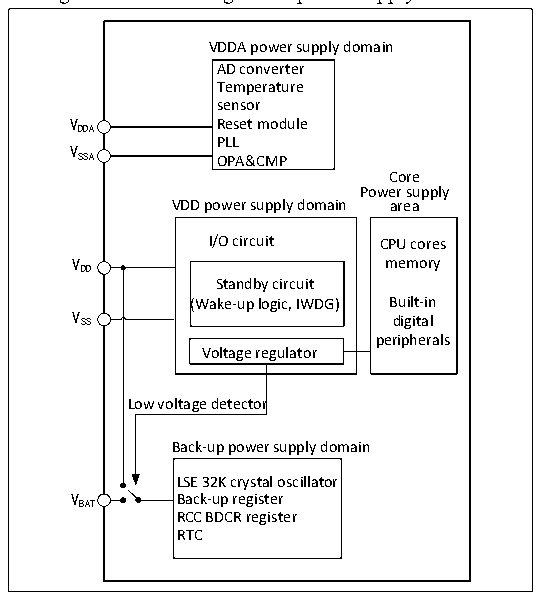

<!-- source-page: 8 -->

[← p.7](0007.md) · [index](../README.md) · [PDF p.8](https://ch32-riscv-ug.github.io/CH32L103/datasheet_en/CH32L103RM.PDF#page=8) · [p.9 →](0009.md)

<!-- header: CH32L103 Reference Manual https://wch-ic.com -->

# Chapter 2 Power Control (PWR)

## 2.1 Overview

The system operating voltage VDD ranges from 1.8 to 3.6 V. The built-in voltage regulator provides the  
low-voltage power supply required by the core. When the main power supply, VDD, is powered down, a backup  
power source such as a battery can provide power for the real-time clock (RTC) and backup registers through the  
VBAT pin. If no backup power is required, it is recommended that VDD be connected directly to the VBAT pin.  
The VDDA and VSSA pins are dedicated to powering analog-related circuits in the system, including ADC,  
temperature sensor, etc.  

Figure 2-1 Block diagram of power supply structure  
 <!-- rendered from the PDF; verify at https://ch32-riscv-ug.github.io/CH32L103/datasheet_en/CH32L103RM.PDF#page=8 -->

🖼 Text parsed from the figure above

VDDA power supply domain  
AD converter  
Temperature  
sensor  
VDDA Reset module  
PLL  
V  
SSA OPA&amp;CMP  
Core  
Power supply  
VDD power supply domain area  
I/O circuit CPU cores  
VDD memory  
Standby circuit  
(Wake-up logic, IWDG) Built-in  
V SS digital  
peripherals  
Voltage regulator  
Low voltage detector  
Back-up power supply domain  
LSE 32K crystal oscillator  
V BAT Back-up register  
RCC BDCR register  
RTC  

After the main power supply VDD is powered down, the analog switch is switched to VBAT and the backup domain  
is powered by the VBAT pin, at this time, PC13 to 15 cannot be used as GPIOs, and only the following functions  
can be used:  
● PC13 can be used as TAMPER pin, RTC alarm clock or second output.  
● PC14 and PC15 can only be used as LSE pins.  
When the main power supply VDD is powered on stably, the system automatically switches the backup area to be  
powered by VDD, and PC13~15 can be used as a GPIO function.  
When the PC13~15 pin is output as a GPIO, the speed must be limited to less than 2MHz, the maximum load  
capacitance must be 30pF, and must not be used in continuous output and suction current situations, such as LED  
drive.  
<em>Note: In the process of restoring the power supply of the main power supply VDD, the internal VBAT power supply is</em>  
<!-- image: p8-draw-image-00001 bbox=[506.76, 783.48, 526.2, 793.8] -->
<!-- footer: V2.2 6 -->
