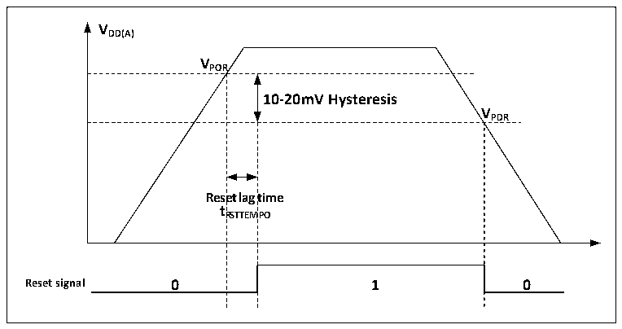

<!-- source-page: 9 -->

[← p.8](0008.md) · [index](../README.md) · [PDF p.9](https://ch32-riscv-ug.github.io/CH32L103/datasheet_en/CH32L103RM.PDF#page=9) · [p.10 →](0010.md)

<!-- header: CH32L103 Reference Manual https://wch-ic.com -->
<em>still connected to the external standby power supply through the corresponding VBAT pins. If the VDD is stable</em>  
<em>within less than the reset lag time tRSTTEMPO and is more than 0.6V higher than the value of VBAT, then there may be</em>  
<em>a short moment when the current is pumped into the VBAT through the diode between the VDD and the VBAT, and</em>  
<em>then injected into the battery and other backup power through the VBAT pin. If the backup power supply cannot</em>  
<em>withstand such instantaneous injection current, it is recommended to add a forward turn-on low voltage drop</em>  
<em>diode between the backup power supply and the VBAT pin.</em>  

## 2.2 Power Management

### 2.2.1 Power-on Reset and Power-down Reset

The system integrated a power-on reset POR and a power-down reset PDR circuit. When the chip supply voltage  
VDD falls below the corresponding threshold voltage, the system is reset by the relevant circuit, and no additional  
external reset circuit is required. Please refer to the corresponding datasheet for the parameters of the power-on  
threshold voltage VPOR and the power-down threshold voltage VPDR.  

Figure 2-2 Schematic diagram of the operation of POR and PDR  
 <!-- rendered from the PDF; verify at https://ch32-riscv-ug.github.io/CH32L103/datasheet_en/CH32L103RM.PDF#page=9 -->

🖼 Text parsed from the figure above

<strong>VDD(A)</strong>  
<strong>VPOR</strong>  
10-20mV Hysteresis  Rese t R  et lag RSTTEM  time MPO  V  
<strong>VPDR</strong>  

### 2.2.2 Programmable Voltage Detector

The programmable voltage detector, PVD, is mainly used to monitor the change of the main power supply of the  
system, compared with the threshold voltage set by PLS[2:0] of the power control register PWR_CTLR, and  
together with the setting of the external interrupt register (EXTI), the relevant interrupt can be generated in order  
to notify the system to carry out the pre-dropout operation, such as the data saving, in time.  
The specific configuration is as follows:  
1) Set the PLS[2:0] fields of the PWR_CTLR register to select the voltage threshold to be monitored.  
2) Optional interrupt handling. the PVD function internally connects to the rising/falling edge trigger setting on  
line 16 of the EXTI module, turns on this interrupt (configures EXTI), and generates a PVD interrupt when VDD  
falls below the PVD threshold or rises above the PVD threshold.  
3) Set the PVDE bit of the PWR_CTLR register to enable the PVD function.  
4) Read the PVD0 bit of PWR_CSR status register to obtain the relationship between the current system main  
power supply and the threshold value set by PLS[2:0], and perform the corresponding soft processing. When the  
VDD voltage is higher than the PLS[2:0] setting threshold, the PVD0 position is 0; when the VDD voltage is lower  
than the PLS[2:0] setting threshold, the PVD0 position is 1.  
<!-- image: p9-draw-image-00001 bbox=[506.76, 783.48, 526.2, 793.8] -->
<!-- footer: V2.2 7 -->
