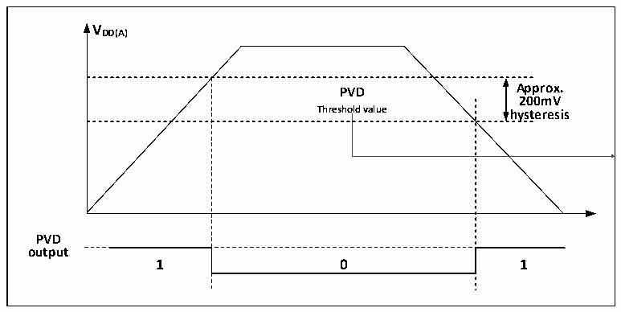

<!-- source-page: 10 -->

[← p.9](0009.md) · [index](../README.md) · [PDF p.10](https://ch32-riscv-ug.github.io/CH32L103/datasheet_en/CH32L103RM.PDF#page=10) · [p.11 →](0011.md)

<!-- header: CH32L103 Reference Manual https://wch-ic.com -->

Figure 2-3 Schematic diagram of PVD operation  
 <!-- rendered from the PDF; verify at https://ch32-riscv-ug.github.io/CH32L103/datasheet_en/CH32L103RM.PDF#page=10 -->

🖼 Text parsed from the figure above

<strong>VDD(A)</strong>  
PVD Threshold value  0  
<strong>200mV</strong>  
<strong>PVD</strong>  
<strong>output</strong>  

## 2.3 Low-power Modes

After a system reset, the microcontroller is in a normal operating state (run mode), where system power can be  
saved by reducing the system main frequency or turning off the unused peripheral clock or reducing the operating  
peripheral clock. If the system does not need to work, you can set the system to enter low-power mode and let the  
system jump out of this state by specific events.  
Microcontrollers currently offer 3 low-power modes, divided in terms of operating differences between processors,  
peripherals, voltage regulators, etc.  
● Sleep mode: The core stops running and all peripherals (including core private peripherals) are still running.  
● Stop mode: Stops all clocks and the system continues to run after waking up. Stop mode is divided into 4  
gears, respectively: Stop mode 1, Stop mode 2, Stop mode 3, Stop mode 4, the corresponding configuration  
method is shown in Table 2-1, stop mode 4 gears after the configuration of the current reference  
CH32L103DS0 manual.  
● Standby mode: Stop all clocks and reset the microcontroller after wakeup (power reset).  

<!-- p10-table-002 (table-2-1@1) pages 10-11 -->
<table><caption>Table 2-1 Low-power mode list</caption><tr><th>Mode</th><th>Entry</th><th>Wake-up source</th><th>Effect on clock</th><th>Voltage regulator</th></tr><tr><td rowspan="2">SLEEP</td><td>WFI</td><td>Any interrupt</td><td rowspan="2" style="text-align:left">Core clock OFF, no effect on other clocks</td><td rowspan="2">Normal</td></tr><tr><td>WFE</td><td>Wake-up event</td></tr><tr><td rowspan="3">STOP</td><td rowspan="3" style="text-align:left">Set SLEEPDEEP to 1 Clear PDDS to 0 WFI or WFE</td><td rowspan="3" style="text-align:left">Any external interrupt/event, NRST pin reset, PVD output, RTC alarm event, USB wake-up signal, USB PD wake-up signal, CMP wake-up signal, LPTIM wake-up signal</td><td rowspan="3" style="text-align:left">Disable HSE, HIS, PLL and peripheral clock</td><td style="text-align:left">Stop mode1: LPDS=0，PDDS=0</td></tr><tr><td style="text-align:left">Stop mode 2 (LDO energy saving mode): LPDS=0, PDDS=0, AUTO_LDO_EC=1 or LPDS=0, PDDS=0, LDO_EC=1</td></tr><tr><td style="text-align:left">Stop mode 3: RAMLV=0, PDDS=0，LPDS=1</td></tr><tr><td style="text-align:left">Stop mode 4: RAMLV=1, PDDS=0，LPDS=1</td></tr><tr><td>STANDBY</td><td style="text-align:left">Set SLEEPDEEP to 1 Set PDDS to 1 WFI or WFE</td><td style="text-align:left">WKUP pin rising edge, RTC alarm event, NRST pin reset, IWDG reset. Note: Any of the EXTI0~EXTI17 external events can also wake up the system, but the system is reset after waking up.</td><td style="text-align:left">Disable HSE, HIS, PLL and peripheral clock</td><td>Off</td></tr></table>

<!-- image: p10-draw-image-00001 bbox=[506.76, 783.48, 526.2, 793.8] -->
<!-- footer: V2.2 8 -->
