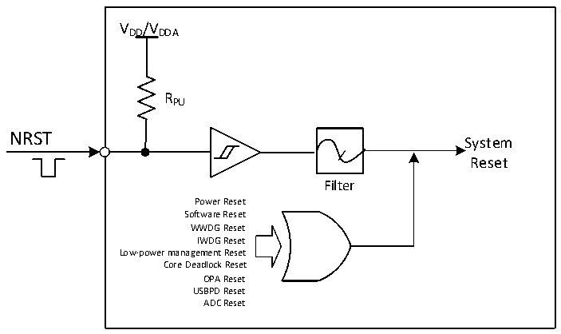

<!-- source-page: 18 -->

[← p.17](0017.md) · [index](../README.md) · [PDF p.18](https://ch32-riscv-ug.github.io/CH32L103/datasheet_en/CH32L103RM.PDF#page=18) · [p.19 →](0019.md)

<!-- header: CH32L103 Reference Manual https://wch-ic.com -->
configuration register PFIC_SCTLR, refer to the corresponding chapter.  
Low-power management reset: By setting the STANDY_RST position 0 in the bytes selected by the user, the  
Standby mode reset will be enabled. After the process of entering the Standby mode is performed, the execution  
system is reset instead of entering the Standby mode. The Stop mode reset is enabled by setting the STOP_RST  
position 0 in the byte selected by the user. At this time, after the process of entering the Stop mode is performed,  
the system will be reset instead of entering the Stop mode.  
Core Deadlock Reset: when the LOCKUP of PFIC_SCTLR register is 0, the kernel deadlock is enabled, and the  
kernel will go into deadlock when it executes exceptions and NMI executes instructions. When the LKUPEN bit  
of the EXTEN_CTR register is enabled, the system will reset in case of a Lock-up condition.  
OPA reset: When the OPA reset is enabled, the high level of the OPA output will cause an OPA reset.  
USBPD Reset: When PD_RST_EN is 1, the CH32L103 supports the reset generated by the Hard Reset of the  
USBPD signal frame. If IE_RX_RESET is also 1, the Reset generated by Cable Reset of signal frames is also  
supported. USBPD does not have a reset flag, but the resulting reset effect is the same as a software reset.  
ADC reset: With the ADC Watchdog reset enabled, ADC reset occurs when ADC data is greater than the  
watchdog high threshold or less than the watchdog low threshold.  

Figure 3-1 System reset structure  
 <!-- rendered from the PDF; verify at https://ch32-riscv-ug.github.io/CH32L103/datasheet_en/CH32L103RM.PDF#page=18 -->

🖼 Text parsed from the figure above

VDD/VDDA  
RPU  
NRST  
System  
Reset  
Filter  
Power Reset  
Software Reset  
WWDG Reset  
IWDG Reset  
Low-power management Reset  
Core Deadlock Reset  
OPA Reset  
USBPD Reset  
ADC Reset  

### 3.2.3 Backup Domain Reset

When a backup domain reset occurs, only the backup domain registers are reset, including the backup registers,  
the RCC_BDCTLR registers (RTC enable and LSE oscillator). The conditions for its generation include:  
● Caused by VDD or VBAT power-up with both VDD and VBAT powered down  
● Set BDRST to 1 of the RCC_BDCTLR register  
● Set BKPRST to 1 of the RCC_PB1PRSTR register  
<!-- image: p18-draw-image-00001 bbox=[511.32, 783.48, 530.76, 793.8] -->
<!-- footer: V2.2 16 -->
