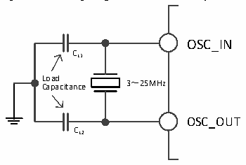

<!-- source-page: 20 -->

[← p.19](0019.md) · [index](../README.md) · [PDF p.20](https://ch32-riscv-ug.github.io/CH32L103/datasheet_en/CH32L103RM.PDF#page=20) · [p.21 →](0021.md)

<!-- header: CH32L103 Reference Manual https://wch-ic.com -->

### 3.3.2 High-speed Clock (HIS/HSE)

HSI is a high-speed clock signal generated by the RC oscillator of 8MHz in the system. The HIS RC oscillator can  
provide the system clock without any external devices. Its start-up time is very short, but the clock frequency  
accuracy is poor. The HSI is turned on and off by setting the HSION bit in the RCC_CTLR register, and the  
HSIRDY bit indicates whether the HSIRC oscillator is stable. The system defaults to HSION and HSIRDY setting  
1 (it is recommended that you do not turn it off). If the HSIRDYIE bit of the RCC_INTR register is set, the  
corresponding interrupt will be generated.  
● The HSI RC oscillator can enter HSILP position 1 into the internal low-power mode through the RCC_CTRL  
register.  
● Factory calibration: differences in manufacturing processes will lead to different RC oscillation frequencies  
of each chip, so HSI calibration is performed for each chip before it leaves the factory. After the system is  
reset, the factory calibration value is loaded into the HSICAL [7:0] in the RCC_CTLR register.  
● User adjustment: depending on the voltage or ambient temperature, the application can adjust the HSI  
frequency through the HSITRIM [4:0] bit in the RCC_CTLR register.  
<em>Note: If the HSE crystal oscillator fails, the HSI clock will be used as a backup clock source (clock security</em>  
<em>system).</em>  
HSE is an external high-speed clock signal, including external crystal/ceramic resonator generation or external  
high-speed clock input.  
HSE crystal oscillator can enter HSELP position 1 into low-power mode through the RCC_CTRL register.  
● External Crystal/Ceramic Resonator (HSE Crystal): An external 3-25MHz external oscillator provides a more  
accurate clock source for the system. Further information can be found in the Electrical Characteristics  
section of the datasheet. The HSE crystal can be turned on and off by setting the HSEON bit in the  
RCC_CTLR register. The HSERDY bit indicates whether the HSE crystal oscillation is stable or not, and the  
hardware sends the clock into the system only after the HSERDY bit is set to one. If the HSERDYIE bit in  
the RCC_INTR register is set, the appropriate interrupt will be generated.  

Figure 3-3 High-speed external crystal circuit  
 <!-- rendered from the PDF; verify at https://ch32-riscv-ug.github.io/CH32L103/datasheet_en/CH32L103RM.PDF#page=20 -->

🖼 Text parsed from the figure above

OSC_IN  
CL1  
L C o a a p d a citance 3～25MHz  
OSC_OUT  
CL2  

<em>Note: The load capacitance needs to be as close as possible to the oscillator pins and the capacitance value</em>  
<em>selected according to the crystal manufacturer&#x27;s parameters.</em>  
● External High Speed Clock Source (HSE Bypass): this mode feeds the clock source directly from the  
external source to the OSC_IN pin, with the OSC_OUT pin dangling. A maximum frequency of 25MHz is  
supported. The application program needs to set the HSEBYP bit to turn on the HSE bypass function with  
the HSEON bit at 0, and then set the HSEON bit again.  
<!-- image: p20-draw-image-00001 bbox=[511.32, 783.48, 530.76, 793.8] -->
<!-- footer: V2.2 18 -->
