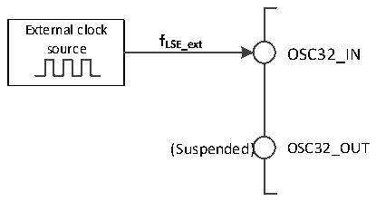

<!-- source-page: 22 -->

[← p.21](0021.md) · [index](../README.md) · [PDF p.22](https://ch32-riscv-ug.github.io/CH32L103/datasheet_en/CH32L103RM.PDF#page=22) · [p.23 →](0023.md)

<!-- header: CH32L103 Reference Manual https://wch-ic.com -->

Figure 3-6 Low-speed clock source circuit  
 <!-- rendered from the PDF; verify at https://ch32-riscv-ug.github.io/CH32L103/datasheet_en/CH32L103RM.PDF#page=22 -->

🖼 Text parsed from the figure above

External clock  
<strong>f</strong>  
source LSE_ext OSC32_IN  
(Suspended) OSC32_OUT  

### 3.3.4 PLL Clock

By configuring the RCC_CFGR0 register and the expansion register EXTEN_CTR, the internal PLL clock can  
choose three clock sources and frequency doubling factors, which must be set before each PLL is turned on, and  
these parameters cannot be changed once the PLL is started. The PLLON bit in the set RCC_CTLR register is  
turned on and off, the PLLRDY bit indicates whether the PLL clock is stable, and the hardware feeds the clock  
into the system after PLLRDY position 1. If the PLLRDYIE bit of the RCC_INTR register is set, the  
corresponding interrupt will be generated.  
PLL clock source:  
● HSI clock feed  
● HSI clock feed through 2-division frequency  
● HSE clock feed  
● HSE clock feed through 2-division frequency  

### 3.3.5 Bus/Peripheral Clock

#### 3.3.5.1 System Clock (SYSCLK)

By configuring the RCC_CFGR0 register SW[1:0] bit to configure the system clock source, SWS[1:0] indicates  
the current system clock source.  
● HSI as the system clock.  
● HSE as the system clock.  
● PLL clock as the system clock.  
After the controller is reset, the default HSI clock is selected as the system clock source. The switching between  
clock sources does not occur until the target clock source is ready.  

#### 3.3.5.2 HB/PB1/PB2 Bus Peripheral Clock (HCLK/PCLK1/PCLK2)

HB (High Performance Bus), whose bus peripheral clock is HCLK; PB1 (Peripheral Bus 1), whose bus peripheral  
clock is PCLK1; and PB2 (Peripheral Bus 2), whose bus peripheral clock is PCLK2.  
By configuring the HPRE [3:0], PPRE1 [2:0] and PPRE2 [2:0] bits of the RCC_CFGR0 register, the clocks of the  
HB, PB1 and PB2 buses can be configured respectively. These bus clocks determine the peripheral interface  
mounted below them to access the clock reference. The application can adjust different values to reduce the power  
consumption of some peripherals.  
Different peripheral modules can be reset and restored to the initial state through each bit in the RCC_HBRSTR,  
RCC_PB1PRSTR and RCC_PB2PRSTR registers.  
The communication clock interface of different peripheral modules can be turned on or off separately through  
<!-- image: p22-draw-image-00001 bbox=[511.32, 783.48, 530.76, 793.8] -->
<!-- footer: V2.2 20 -->
