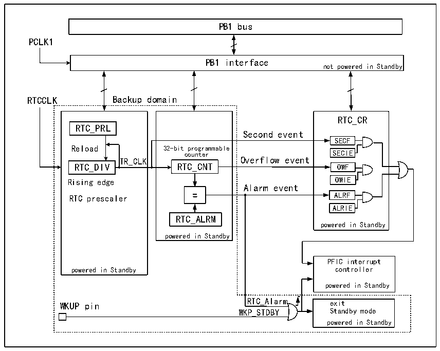

<!-- source-page: 46 -->

[← p.45](0045.md) · [index](../README.md) · [PDF p.46](https://ch32-riscv-ug.github.io/CH32L103/datasheet_en/CH32L103RM.PDF#page=46) · [p.47 →](0047.md)

<!-- header: CH32L103 Reference Manual https://wch-ic.com -->

# Chapter 6 Real Time Clock (RTC)

The Real Time Clock (RTC) is a standalone timer module with a programmable counter up to 32 bits, which can  
be used with software to realize the real time clock function, and the counter value can be modified to reconfigure  
the current time and date of the system. The RTC module is in the backup power supply area, and the system reset  
and wake-up from Standby mode do not have any effect on it.  

## 6.1 Main Features

● Prescaler coefficients up to 220  
● 32-bit programmable counter  
● Multiple clock sources, interrupts  
● Independent reset  

## 6.2 Function Description

### 6.2.1 Overview

Figure 6-1 RTC structure diagram  
 <!-- rendered from the PDF; verify at https://ch32-riscv-ug.github.io/CH32L103/datasheet_en/CH32L103RM.PDF#page=46 -->

🖼 Text parsed from the figure above

PB1 bus  
PCLK1  
PB1 interface  
not powered in Standby  
RTCCLK Backup domain  
32-bit programmable counter RTC_CNTRTC_ALRM powered in Standby  
RTC_CR  
RTC_PRL  
Second event  
SECF  
Reload 32-bit programmable  
SECIE  OWF  
counter SECIE  
Rising edge OWIE  
Alarm event  
ALRIE  
powered in Standby  
PFIC interrupt  
powered in Standby controller  
powered in Standby  
WKUP pin RTC_Alarm exit  
WKP_STDBY Standby mode  
powered in Standby  

As shown in figure 6-1, the RTC module is mainly composed of 3 parts: PB1 bus interface, frequency divider and  
counter, control and status register, in which the frequency divider and counter are in the backup area and can be  
powered by VBAT. After inputting the frequency divider (RTC_DIV), the RTCCK is divided into TR_CLK. It is  
worth noting that the inside of the frequency divider (RTC_DIV) is a self-subtractive counter, which will output a  
<!-- image: p46-draw-image-00001 bbox=[511.32, 783.48, 530.76, 793.8] -->
<!-- footer: V2.2 44 -->
