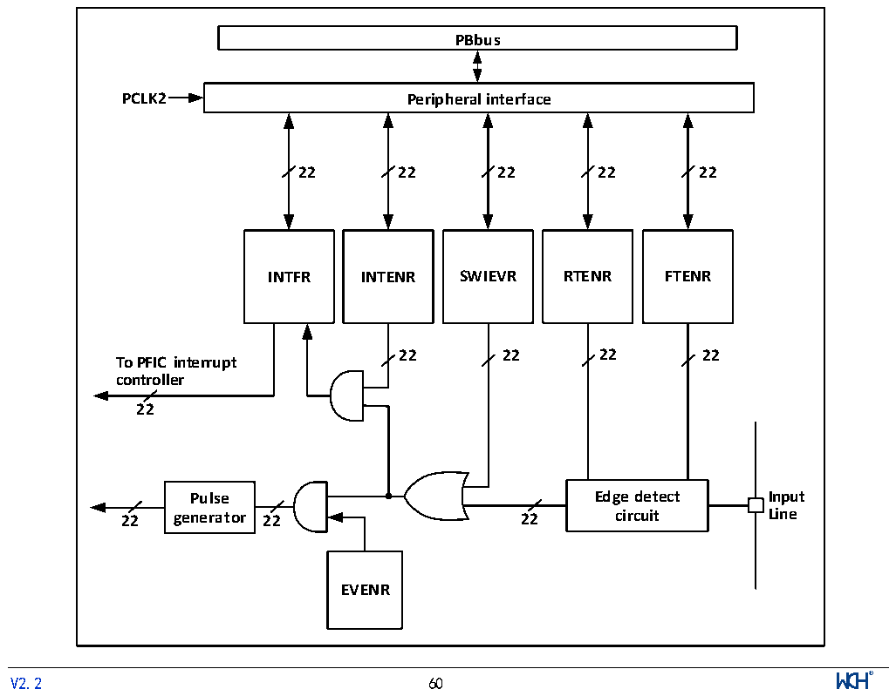

<!-- source-page: 62 -->

[← p.61](0061.md) · [index](../README.md) · [PDF p.62](https://ch32-riscv-ug.github.io/CH32L103/datasheet_en/CH32L103RM.PDF#page=62) · [p.63 →](0063.md)

<!-- header: CH32L103 Reference Manual https://wch-ic.com -->

> ⬆ **Table continued** — rendered in full at [page 60](0060.md). <!-- p62-table-001 -->

## 9.4 External Interrupt and Event Controller (EXTI)

### 9.4.1 Overview

Figure 9-1 External interrupt (EXTI) interface block diagram  
 <!-- rendered from the PDF; verify at https://ch32-riscv-ug.github.io/CH32L103/datasheet_en/CH32L103RM.PDF#page=62 -->

🖼 Text parsed from the figure above

<strong>PBbus</strong>  
<strong>PCLK2 Peripheral interface</strong>  
<strong>22 22 22 22 22</strong>  
<strong>INTFR INTENR SWIEVR RTENR FTENR</strong>  
<strong>22 22 22 22</strong>  
<strong>To PFIC interrupt</strong>  
<strong>controller</strong>  
<strong>22</strong>  
<strong>Pulse Edge detect Input</strong>  
<strong>22 generator 22 22 circuit Line</strong>  
<strong>EVENR</strong>  
<!-- image: p62-draw-image-00001 inside the figure -->
<!-- footer: V2.2 60 -->

