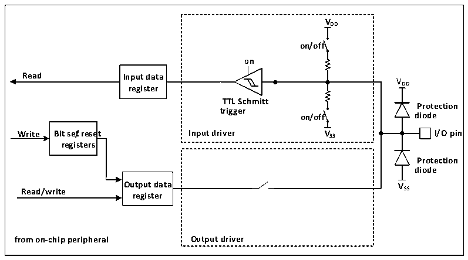

<!-- source-page: 93 -->

[← p.92](0092.md) · [index](../README.md) · [PDF p.93](https://ch32-riscv-ug.github.io/CH32L103/datasheet_en/CH32L103RM.PDF#page=93) · [p.94 →](0094.md)

<!-- header: CH32L103 Reference Manual https://wch-ic.com -->
● Using the alternate function in the output direction, the port must be configured in the alternate output mode,  
and push-pull or open-drain can be set according to the actual situation.  
● For two-way alternate, the port must be configured in multiplexed output mode, when the driver is  
configured in floating input mode.  
Multiple peripherals may be reused to this pin in the same IO port, so in order to maximize the exertion space of  
each peripheral, the multiplex pin of the peripheral can be remapped and remapped to other pins to avoid the  
occupied pins in addition to the default alternate pin.  

### 10.2.5 Locking Mechanism

The locking mechanism can lock the configuration of the IO port. After a specific write sequence, the selected IO  
pin configuration is locked and cannot be changed until the next reset.  

### 10.2.6 Input Configuration

Figure 10-2 Input configuration structure block diagram of GPIO module  
 <!-- rendered from the PDF; verify at https://ch32-riscv-ug.github.io/CH32L103/datasheet_en/CH32L103RM.PDF#page=93 -->

🖼 Text parsed from the figure above

<strong>VDD</strong>  
<strong>on/off</strong>  
<strong>on</strong>  
<strong>Read Input data</strong>  
VDD  
<strong>register</strong>  
<strong>TTL Schmitt</strong>  
<strong>Protection</strong>  
<strong>trigger</strong>  
<strong>on/off diode</strong>  
<strong>Write Bit se/treset Input driver VSS I/O pin</strong>  
<strong>registers</strong>  
<strong>Protection</strong>  
<strong>diode</strong>  
<strong>Output data VSS</strong>  
<strong>Read/write</strong>  
<strong>register</strong>  
<strong>from on-chip peripheral Output driver</strong>  

When the IO port is configured in input mode, the output driver is disconnected, the input up and down is optional,  
and the alternate function and analog input are not connected. The data on each IO port is sampled to the input  
data register at each PB2 clock, and the level state of the corresponding pin is obtained by reading the  
corresponding bit of the input data register.  
<!-- image: p93-draw-image-00001 bbox=[511.32, 783.48, 530.76, 793.8] -->
<!-- footer: V2.2 91 -->
