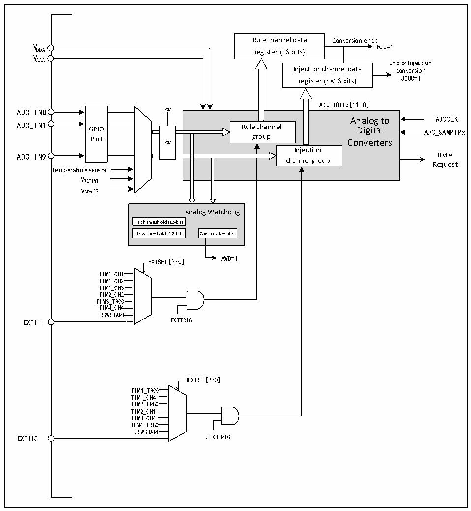

<!-- source-page: 128 -->

[← p.127](0127.md) · [index](../README.md) · [PDF p.128](https://ch32-riscv-ug.github.io/CH32L103/datasheet_en/CH32L103RM.PDF#page=128) · [p.129 →](0129.md)

<!-- header: CH32L103 Reference Manual https://wch-ic.com -->

## 12.2 Functional Description

### 12.2.1 Module Structure

Figure 12-1 ADC module block diagram  
 <!-- rendered from the PDF; verify at https://ch32-riscv-ug.github.io/CH32L103/datasheet_en/CH32L103RM.PDF#page=128 -->

🖼 Text parsed from the figure above

Rule channel data Conversion ends  
V EOC=1  
DDA register (16 bits)  
V  
SSA End of Injection  
Injection channel data conversion  
register (4×16 bits) JEOC=1  
-ADC_IOFRx[11:0]  
GPIOPort  
Analog to Rule channel Digital group Converters Injection channel group  PGA  
Analog to ADCCLK  
ADC_IN9 DMA  
Request  
Temperature sensor  
VREFINT  
VDDA/2  
Analog Watchdog  
High threshold (12-bit)  Low threshold (12-bit)  
Low threshold (12-bit) Compare Results  
AWD=1  
EXTSEL[2:0]  
TIM1_CH11  
TIM1_CH2  
TIM1_CH3  
TIM2_CH2  
TIM3_TRG0  
TIM4_CH4  
RSWSTART  
EXTI11 EXTTRIG  
JEXTSEL[2:0]  
TIM1_TRG0  
TIM1_CH4  
TIM2_TRG0  
TIM2_CH1  
TIM3_CH4  
TIM4_TRG0  
JSWSTART  
EXTI15 JEXTTRIG  

### 12.2.2 ADC Configuration

1) Module power on  
An ADON bit of 1 in the ADC_CTLR2 register indicates that the ADC module is powered on. When the ADC  
module enters the power-on state (ADON=1) from the power-off mode (ADON=0), it needs to be delayed for a  
period of time for t to stabilize the module. After that, the ADON bit is written again as 1, which is used as the  
STAB  
startup signal for the software to start the ADC conversion. By clearing the ADON bit to 0, you can terminate the  
current conversion and put the ADC module in power-off mode, where ADC consumes almost no power.  
<!-- image: p128-draw-image-00001 bbox=[515.76, 783.48, 535.2, 793.8] -->
<!-- footer: V2.2 126 -->
