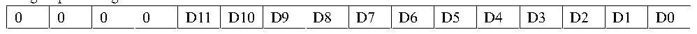

<!-- source-page: 130 -->

[← p.129](0129.md) · [index](../README.md) · [PDF p.130](https://ch32-riscv-ug.github.io/CH32L103/datasheet_en/CH32L103RM.PDF#page=130) · [p.131 →](0131.md)

<!-- header: CH32L103 Reference Manual https://wch-ic.com -->

<!-- p130-table-001 (table-11-2@1) -->
<table><tr><th>SMPx[2:0]</th><th>Sample time (ADC_LP=0)</th><th>Sample time (ADC_LP=1)</th></tr><tr><td>000</td><td>1.5 cycles</td><td>7.5 cycles</td></tr><tr><td>001</td><td>7.5 cycles</td><td>11.5 cycles</td></tr><tr><td>010</td><td>13.5 cycles</td><td>17.5 cycles</td></tr><tr><td>011</td><td>28.5 cycles</td><td>27.5 cycles</td></tr><tr><td>100</td><td>41.5 cycles</td><td>47.5 cycles</td></tr><tr><td>101</td><td colspan="2">55.5 cycles</td></tr><tr><td>110</td><td colspan="2">71.5 cycles</td></tr><tr><td>111</td><td colspan="2">239.5 cycles</td></tr></table>

The regular channel transformation of ADC supports the DMA feature. The value of regular channel conversion is  
stored in a single data register ADC_RDATAR. In order to prevent the continuous conversion of multiple regular  
channels from not taking the data from the ADC_RDATAR register in time, the DMA function of ADC can be  
turned on. The hardware generates an DMA request at the end of the conversion of the regular channel (EOC  
setting) and transfers the translated data from the ADC_RDATAR register to the destination address specified by  
the user.  
After the channel configuration of the DMA controller module is completed, write the DMA location 1 of the  
ADC_CTLR2 register and turn on the DMA function of ADC.  
<em>Note: the injection group transformation does not support the DMA feature.</em>  
6) Data alignment  
The ALIGN bit in the ADC_CTLR2 register selects the data storage alignment after ADC conversion. 12-bit data  
supports left and right alignment modes.  
The data register ADC_RDATAR of the regular group channel stores the actual converted 12-bit digital value,  
while the data register ADC_IDATARx of the injected group channel is the value written after the actual  
converted data minus the offset of the ADC_IOFRx register, so there are positive and negative SIGNB.  

Figure 12-2 Data left alignment  
 <!-- rendered from the PDF; verify at https://ch32-riscv-ug.github.io/CH32L103/datasheet_en/CH32L103RM.PDF#page=130 -->

Rule group data register  

🖼 Text parsed from the figure above

D11  D10  D9  D8  D7  D6  D5  D4  D4  D2  D1  D0  0  0  0  0  

Injected group data register  

<!-- p130-table-003 (table-11-2@1) -->
<table><tr><th>SIGNB</th><th>D11</th><th>D10</th><th>D9</th><th>D8</th><th>D7</th><th>D6</th><th>D5</th><th>D4</th><th>D3</th><th>D2</th><th>D1</th><th>D0</th><th>0</th><th>0</th><th>0</th></tr></table>

Figure 12-3 Data right alignment  
 <!-- rendered from the PDF; verify at https://ch32-riscv-ug.github.io/CH32L103/datasheet_en/CH32L103RM.PDF#page=130 -->

Rule group data register  

🖼 Text parsed from the figure above

0  0  0  0  D11  D10  D9  D8  D7  D6  D5  D4  D3  D2  D1  D0  

Injected group data register  

<!-- p130-table-005 (table-11-2@1) -->
<table><tr><th>SIGNB</th><th>SIGNB</th><th>SIGNB</th><th>SIGNB</th><th>D11</th><th>D10</th><th>D9</th><th>D8</th><th>D7</th><th>D6</th><th>D5</th><th>D4</th><th>D3</th><th>D2</th><th>D1</th><th>D0</th></tr></table>

7) ADC configuration enable  
The ADC module provides an ADC_CFG register that enables a module function by setting the corresponding  
control bit.  
The ADC_DUTY_EN bit is the ADC clock duty cycle control bit. When this position is 1, the input clock is  
delayed 4ns to get an ADC clock with a duty cycle of about 75%. When set to 0, the input clock is not processed.  
<!-- image: p130-draw-image-00001 bbox=[515.76, 783.48, 535.2, 793.8] -->
<!-- footer: V2.2 128 -->
