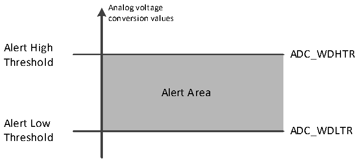

<!-- source-page: 135 -->

[← p.134](0134.md) · [index](../README.md) · [PDF p.135](https://ch32-riscv-ug.github.io/CH32L103/datasheet_en/CH32L103RM.PDF#page=135) · [p.136 →](0136.md)

<!-- header: CH32L103 Reference Manual https://wch-ic.com -->
injection conversion flag JEOC is set, and an interrupt is generated if JEOCIE is set.  

### 12.2.5 Analog Watchdog

If the analog voltage being converted by the ADC is below the low threshold or above the high threshold, the  
AWD analog watchdog status bit is set. The threshold setting is located in the lowest 12 valid bits of the  
ADC_WDHTR and ADC_WDLTR registers. The corresponding interrupt is allowed to be generated by setting  
the AWDIE bit in the ADC_CTLR1 register. Analog watchdog reset can be enabled by setting the AWDRST_EN  
bit of the ADC_CFG register.  

Figure 12-4 Analog watchdog threshold area  
 <!-- rendered from the PDF; verify at https://ch32-riscv-ug.github.io/CH32L103/datasheet_en/CH32L103RM.PDF#page=135 -->

🖼 Text parsed from the figure above

Analog voltage  
conversion values  
Alert High  
ADC_WDHTR  
<!-- image: p135-draw-image-00002 inside the figure -->
Threshold  
Alert Area  
Alert Low  
ADC_WDLTR  
Threshold  

Configure the AWDSGL, AWDEN, JAWDEN, and AWDCH[4:0] bits of the ADC_CTLR1 register to select the  
channel for analog watchdog alert, see the following table for the relationship:  

<!-- p135-table-001 (table-12-4@1) -->
<table><caption>Table 12-4 Analog Watchdog channel selection</caption><tr><th rowspan="2" style="text-align:left">Analog Watchdog alert channel</th><th colspan="4">ADC_CTLR1 register control bit</th></tr><tr><td>AWDSGL</td><td>AWDEN</td><td>JAWDEN</td><td>AWDCH[4:0]</td></tr><tr><td>No alert</td><td>Ignore</td><td>0</td><td>0</td><td>Ignore</td></tr><tr><td>All injection channels</td><td>0</td><td>0</td><td>1</td><td>Ignore</td></tr><tr><td>All rule channels</td><td>0</td><td>1</td><td>0</td><td>Ignore</td></tr><tr><td style="text-align:left">All injection and rule channels</td><td>0</td><td>1</td><td>1</td><td>Ignore</td></tr><tr><td>Single injected channel</td><td>1</td><td>0</td><td>1</td><td style="text-align:left">Determine channel No.</td></tr><tr><td>Single regular channel</td><td>1</td><td>1</td><td>0</td><td style="text-align:left">Determine channel No.</td></tr><tr><td style="text-align:left">Single injected and regular channel</td><td>1</td><td>1</td><td>1</td><td style="text-align:left">Determine channel No.</td></tr></table>

### 12.2.6 Temperature Sensor

Chip built-in temperature sensor, connected to the ADC_INT16 channel, through ADC to convert the output  
voltage of the sensor into digital value to feedback the internal temperature of the chip, it is recommended to set  
the sampling time is 17.1μs. The output voltage of the temperature sensor varies linearly with the temperature.  
Due to the manufacturing discreteness, the slope and offset of the linear curve are different, so the internal  
<!-- image: p135-draw-image-00001 bbox=[515.76, 783.48, 535.2, 793.8] -->
<!-- footer: V2.2 133 -->
