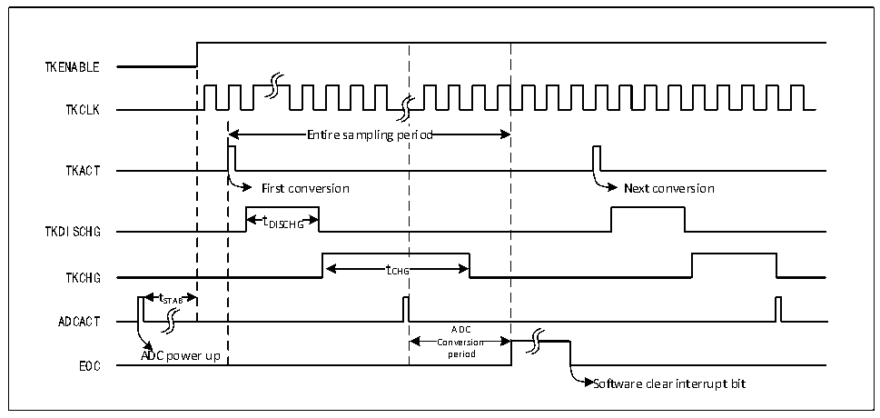

<!-- source-page: 149 -->

[← p.148](0148.md) · [index](../README.md) · [PDF p.149](https://ch32-riscv-ug.github.io/CH32L103/datasheet_en/CH32L103RM.PDF#page=149) · [p.150 →](0150.md)

<!-- header: CH32L103 Reference Manual https://wch-ic.com -->

# Chapter 13 Touch Key Detection (TKEY)

The touch detection control (TKEY) unit, with the help of the voltage conversion function of the ADC module,  
realizes the touch key detection function by converting the capacitance to the voltage for sampling. The detection  
channel reuses 10 external channels of the ADC, and the touch key detection is realized through the single  
conversion mode of the ADC module.  

## 13.1 Functional Description

● Enable TKEY  
For TKEY detection, the ADC module is needed. To enable TKEY, ensure that ADC is powered on (ADON=1),  
then set the TKENABLE bit in the ADC_CTLR1 register to 1. The charge current of the TKEY module can be  
adjusted by the TKITUNE bit.  
TKEY only supports single 1-channel conversion mode, which configures the channel to be converted as the first  
channel in the regular sequence of ADC. And software starts conversion (write to TKEY_ACT_DCG).  
<em>Note: When the TKEY conversion is disabled, ADC channel configuration function can still be retained.</em>  

Figure 13-1 TKEY working timing diagram  
 <!-- rendered from the PDF; verify at https://ch32-riscv-ug.github.io/CH32L103/datasheet_en/CH32L103RM.PDF#page=149 -->

🖼 Text parsed from the figure above

TKENABLE  
TKCLK  
Entire sampling pe  eriod  Entire sampling pe  eriod  
TKACT  
First conversion Next conversion  
t  
TKDISCHG DISCHG  
tCHG  tCHG  
TKCHG  
t  tSTAB  
ADCACT  
ADCConversion  Conversion period  
ADC power up period  
EOC  
Software clear interrupt bit  

● Programmable sampling time  
The TKEY unit conversion requires discharging the channel using a number of ADCCLK clock cycles (tDISCHG)  
before charging the channel for voltage sampling over a number of ADCCLK cycles (tCHG), the number of  
charging cycles being the configured value of SMPx[2:0] in the ADC_SAMPTR2 register plus the  
TKEY_CHGOFFSET offset. Each channel can be individually adjusted with a different charging cycle for the  
sampling voltage.  
● TKEY multi-mask  
TKEY_DRV_EN bit is valid at high level, when set, TOUCHKEY multi-masking enable, for the control of the  
channel master switch; TKEY_DRV_OUTEN bit is valid at high level, when enabled, individually control each  
channel enable.  
<!-- image: p149-draw-image-00001 bbox=[515.76, 783.48, 535.2, 793.8] -->
<!-- footer: V2.2 147 -->
