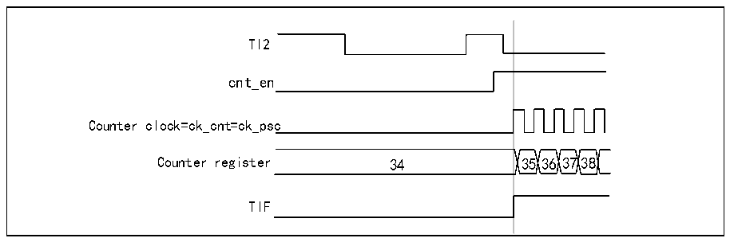

<!-- source-page: 165 -->

[← p.164](0164.md) · [index](../README.md) · [PDF p.165](https://ch32-riscv-ug.github.io/CH32L103/datasheet_en/CH32L103RM.PDF#page=165) · [p.166 →](0166.md)

<!-- header: CH32L103 Reference Manual https://wch-ic.com -->
not require any filter, so keep IC2F = 0000). There is no need to configure the capture divider as it is not used for  
trigger operation. the CC2S bit selects only the input capture source by setting CC2S=01 (in R16_TIMx_CCMR1).  
Write CC2P=1 and CC2NP=&#x27;0&#x27; to the R16_TIMx_CCER register to verify polarity (detect low level only)  
2) Write SMS=110 to R16_TIMx_SMCFGR register to configure the timer to trigger mode; write TS=110 to  
R16_TIMx_SMCFGR register to select TI2 as input source.  
When there is a rising edge of TI2, the counter starts counting driven by the internal clock, while TIF is set to 1.  
The delay between the rising edge of TI2 and the actual counter start is caused by the resynchronization circuitry  
at the TI2 input.  

Figure 14-8 Control circuit in trigger mode  
 <!-- rendered from the PDF; verify at https://ch32-riscv-ug.github.io/CH32L103/datasheet_en/CH32L103RM.PDF#page=165 -->

🖼 Text parsed from the figure above

TI2  
cnt_en  
Counter clock=ck_cnt=ck_psc  
Counter register 34 3536 3738  
TIF  

<strong>Slave mode: external clock mode 2 + trigger mode</strong>  
External clock mode 2 can be used in conjunction with another slave mode in addition to external clock mode 1  
and encoder mode. In this case, the ETR signal is used as an input to the external clock and the other input can be  
used as a trigger input in reset mode, gated mode or trigger mode. It is not recommended to select ETR as TRGI  
via the TS bit of the R16_TIMx_SMCFGR register. in the following example, the up counter is incremented on  
each rising edge of ETR as soon as a rising edge occurs on TI1:  
1) Configuring the R16_TIMx_SMCFGR register to configure the external trigger input circuit:  
- -ETF=0000: no filtering;
─ETPS=00: no prescaler used;  
─ETP=0: detect the rising edge of ETR, set ECE=1 to enable external clock mode 2.  
2) Configure channel 1 to detect the rising edge of TI:  
─IC1F=0000: no filtering;  
─no need to configure the capture divider as it is not used for trigger operation;  
- -setting CC1S=01 in the R16_TIMx_CHCTLR1 register to select the input capture source;
- set CC1P=0 in the R16_TIMx_CCER register to determine the polarity (only rising edges are detected).
3) Write SMS=110 to R16_TIMx_SMCFGR register to configure the timer to trigger mode. Write TS=101 to the  
R16_TIMx_SMCFGR register to select TI1 as the input source.  
When a rising edge occurs on TI1, the counter is enabled, TIF is set to 1 and the counter starts counting on the  
rising edge of ETR. the delay between the rising edge of the ETR signal and the actual counter reset is caused by  
the resynchronization circuit at the ETRP input.  
<!-- image: p165-draw-image-00001 bbox=[515.76, 783.48, 535.2, 793.8] -->
<!-- footer: V2.2 163 -->
