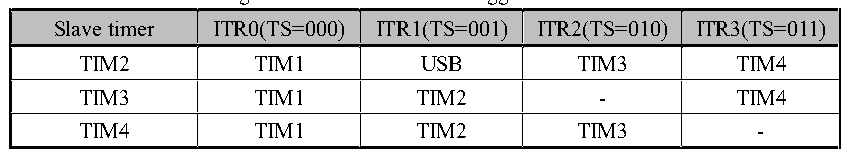

<!-- source-page: 202 -->

[← p.201](0201.md) · [index](../README.md) · [PDF p.202](https://ch32-riscv-ug.github.io/CH32L103/datasheet_en/CH32L103RM.PDF#page=202) · [p.203 →](0203.md)

<!-- header: CH32L103 Reference Manual https://wch-ic.com -->
encoder. The count direction of the core counter is synchronized with the rotating shaft of the encoder. Each pulse  
output by the encoder will increase the core counter by adding one or subtracting one. The steps to use the encoder  
are: set the SMS field to 001b (count only on TI2 edge), 010b (count only on TI1 edge) or 011b (count on both  
TI1 and TI2 edges), and connect the encoder to compare/capture 1, 2 inputs, set a value for the reload value  
register and this value can be set to be greater. In the encoder mode, the internal compare/capture register of timer,  
prescaler, repeat count register and other registers all work normally. The following table shows the relationship  
between the counting direction and the encoder signal.  

<!-- p202-table-001 (table-15-1@1) -->
<table><caption>Table 15-1 Relationship between count direction of timer in encoder mode and encoder signal</caption><tr><th rowspan="2">Count active edge</th><th rowspan="2" style="text-align:left">Relative signal level</th><th colspan="2">TI1FP1 signal edge</th><th colspan="2">TI2FP2 signal edge</th></tr><tr><td style="text-align:left">Rising edge</td><td style="text-align:left">Falling edge</td><td style="text-align:left">Rising edge</td><td style="text-align:left">Falling edge</td></tr><tr><td rowspan="2">Only count at TI1 edge</td><td>High</td><td>Downcount</td><td>Upcount</td><td rowspan="2" colspan="2">Not count</td></tr><tr><td>Low</td><td>Upcount</td><td>Downcount</td></tr><tr><td rowspan="2">Only count at TI2 edge</td><td>High</td><td rowspan="2" colspan="2">Not count</td><td>Upcount</td><td>Downcount</td></tr><tr><td>Low</td><td>Downcount</td><td>Upcount</td></tr><tr><td rowspan="2" style="text-align:left">Count on both edges of TI1 and TI2</td><td>High</td><td>Downcount</td><td>Upcount</td><td>Upcount</td><td>Downcount</td></tr><tr><td>Low</td><td>Upcount</td><td>Downcount</td><td>Downcount</td><td>Upcount</td></tr></table>

### 15.3.8 Timer Synchronous Mode

The timer can output clock pulses (TRGO) and can also receive input from other timers (ITRx). The sources of  
ITRx of different timers (TRGO of other timers) are different. Table 15-2 shows the internal trigger connection of  
timers.  

Figure 15-2 GTPM internal trigger connection  
 <!-- rendered from the PDF; verify at https://ch32-riscv-ug.github.io/CH32L103/datasheet_en/CH32L103RM.PDF#page=202 -->

🖼 Text parsed from the figure above

<!-- p202-table-003 (table-15-1@1) -->
<table><tr><th>Slave timer</th><th>ITR0(TS=000)</th><th>ITR1(TS=001)</th><th>ITR2(TS=010)</th><th>ITR3(TS=011)</th></tr><tr><td>TIM2</td><td>TIM1</td><td>USB</td><td>TIM3</td><td>TIM4</td></tr><tr><td>TIM3</td><td>TIM1</td><td>TIM2</td><td>-</td><td>TIM4</td></tr><tr><td>TIM4</td><td>TIM1</td><td>TIM2</td><td>TIM3</td><td>-</td></tr></table>

### 15.3.9 Debug Mode

When the system enters debug mode, the timer continues to run or stops according to the setting of the DBG  
module.  

## 15.4 Register Description

<!-- p202-table-004 (table-15-3@1) pages 202-203 -->
<table><caption>Table 15-3 TIM2 registers</caption><tr><th>Name</th><th>Offset address</th><th>Description</th><th>Reset value</th></tr><tr><td>R16_TIM2_CTLR1</td><td>0x40000000</td><td>TIM2 control register1</td><td>0x0000</td></tr><tr><td>R16_TIM2_CTLR2</td><td>0x40000004</td><td>TIM2 control register2</td><td>0x0000</td></tr><tr><td>R16_TIM2_SMCFGR</td><td>0x40000008</td><td>TIM2 slave mode configuration register</td><td>0x0000</td></tr><tr><td>R16_TIM2_DMAINTENR</td><td>0x4000000C</td><td>TIM2 DMA/interrupt enable register</td><td>0x0000</td></tr><tr><td>R16_TIM2_INTFR</td><td>0x40000010</td><td>TIM2 interrupt flag register</td><td>0x0000</td></tr><tr><td>R16_TIM2_SWEVGR</td><td>0x40000014</td><td>TIM2 event generation register</td><td>0x0000</td></tr><tr><td>R16_TIM2_CHCTLR1</td><td>0x40000018</td><td>TIM2 compare/capture control register 1</td><td>0x0000</td></tr><tr><td>R16_TIM2_CHCTLR2</td><td>0x4000001C</td><td>TIM2 compare/capture control register 2</td><td>0x0000</td></tr><tr><td>R16_TIM2_CCER</td><td>0x40000020</td><td>TIM2 compare/capture enable register</td><td>0x0000</td></tr><tr><td>R16_TIM2_CNT</td><td>0x40000024</td><td>TIM2 counter</td><td>0x0000</td></tr><tr><td>R16_TIM2_PSC</td><td>0x40000028</td><td>TIM2 prescaler</td><td>0x0000</td></tr><tr><td>R16_TIM2_ATRLR</td><td>0x4000002C</td><td>TIM2 auto-reload register</td><td>0xFFFF</td></tr><tr><td>R32_TIM2_CH1CVR</td><td>0x40000034</td><td>TIM2 compare/capture register 1</td><td>0x00000000</td></tr><tr><td>R32_TIM2_CH2CVR</td><td>0x40000038</td><td>TIM2 compare/capture register 2</td><td>0x00000000</td></tr><tr><td>R32_TIM2_CH3CVR</td><td>0x4000003C</td><td>TIM2 compare/capture register 3</td><td>0x00000000</td></tr><tr><td>R32_TIM2_CH4CVR</td><td>0x40000040</td><td>TIM2 compare/capture register 4</td><td>0x00000000</td></tr><tr><td>R16_TIM2_DMACFGR</td><td>0x40000048</td><td>TIM2 DMA configuration register</td><td>0x0000</td></tr><tr><td>R16_TIM2_DMAADR</td><td>0x4000004C</td><td style="text-align:left">TIM2 DMA address register in continuous mode</td><td>0x00000000</td></tr></table>

<!-- image: p202-draw-image-00001 bbox=[515.76, 783.48, 535.2, 793.8] -->
<!-- footer: V2.2 200 -->
