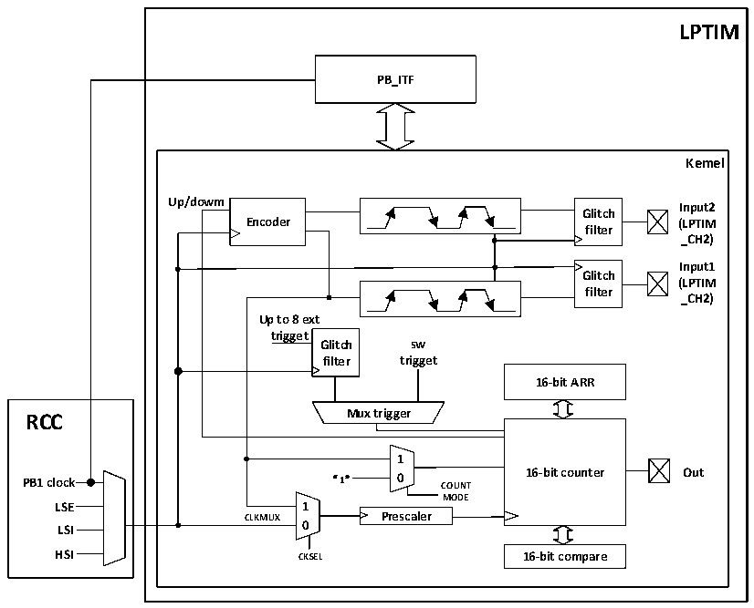

<!-- source-page: 224 -->

[← p.223](0223.md) · [index](../README.md) · [PDF p.224](https://ch32-riscv-ug.github.io/CH32L103/datasheet_en/CH32L103RM.PDF#page=224) · [p.225 →](0225.md)

<!-- header: CH32L103 Reference Manual https://wch-ic.com -->

## 16.2 Function Description

### 16.2.1 LPTIM Structure

Figure 16-1 Block diagram of LPTIM  
 <!-- rendered from the PDF; verify at https://ch32-riscv-ug.github.io/CH32L103/datasheet_en/CH32L103RM.PDF#page=224 -->

🖼 Text parsed from the figure above

<strong>LPTIM</strong>  
<strong>PB_ITF</strong>  
<strong>Kemel</strong>  
<strong>Up/dowm Input2</strong>  
<strong>Glitch</strong>  
owm  
<strong>Encoder (LPTIM</strong>  
<strong>filter</strong>  
<strong>_CH2)</strong>  
<strong>Input1</strong>  
<strong>Glitch</strong>  
<strong>(LPTIM</strong>  
<strong>filter</strong>  
<strong>_CH2)</strong>  
<strong>Up to 8 ext</strong>  
<strong>trigget</strong>  
<strong>Glitch sw</strong>  
<strong>filter trigget</strong>  
<strong>16-bit ARR</strong>  
<strong>1</strong>  
<strong>PB1 clock “1” 0 COUNT 16-bit counter Out</strong>  
<strong>MODE</strong>  
<strong>LSE 1</strong>  
<strong>CLKMUX Prescaler</strong>  
<strong>LSI 0</strong>  
<strong>HSI CKSEL 16-bit compare</strong>  

## 16.3 LPTIM Trigger Mapping

The information for LPTIM external trigger connections is as follows:  

<!-- p224-table-002 (table-16-1@1) -->
<table><caption>Table 16-1 LPTIM external trigger connection</caption><tr><th>TRIGSEL[1:0]</th><th>External trigger</th></tr><tr><td>LPTIM_TRG_00</td><td>LPTIM_ETR(PB6/PB14)</td></tr><tr><td>LPTIM_TRG_01</td><td>RTC_ALARM</td></tr><tr><td>LPTIM_TRG_10</td><td>TAMPER (PC13)</td></tr></table>

### 16.3.1 LPTIM Reset and Clock

The reset of the LPTIM module is controlled by the LPTIMRST bit of the RCC_PB1PRSTR register, which has  
no effect when setting 0 and resets the module when setting 1.  
The LPTIM module clock is controlled by the LPTIMEN bit of the RCC_PB1PCENR register. The module clock  
is turned off at 0 and turned on at 1.  
The counting clock of LPTIM is provided by multiple optional clock sources, which can be divided into internal  
clock sources and external clock sources.  
<!-- image: p224-draw-image-00001 bbox=[515.76, 783.48, 535.2, 793.8] -->
<!-- footer: V2.2 222 -->
