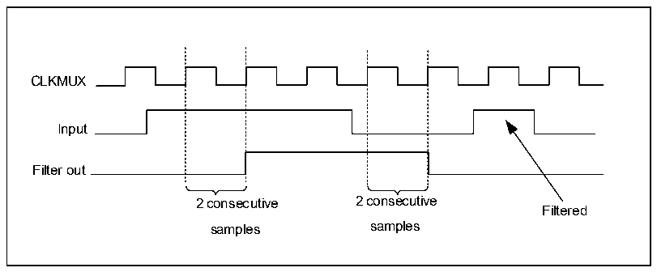

<!-- source-page: 226 -->

[← p.225](0225.md) · [index](../README.md) · [PDF p.226](https://ch32-riscv-ug.github.io/CH32L103/datasheet_en/CH32L103RM.PDF#page=226) · [p.227 →](0227.md)

<!-- header: CH32L103 Reference Manual https://wch-ic.com -->

Figure 16-2 Timing block diagram of interference filter  
 <!-- rendered from the PDF; verify at https://ch32-riscv-ug.github.io/CH32L103/datasheet_en/CH32L103RM.PDF#page=226 -->

🖼 Text parsed from the figure above

CLKMUX  
Input  
Filter out  
2 consecutive 2 consecutive  
Filtered  
samples samples  

<em>Note: when the internal clock signal is not used, the digital filter must be disabled by zeroing the CKFLT and</em>  
<em>TRGFLT bits, and using an external analog filter to avoid interference caused by the external input of the LPTIM.</em>  

### 16.3.3 Prescaler

There should be a configurable 2n prescaler in front of the LPTIM16 bit counter. The division ratio of the  
prescaler is controlled by the 3-bit field of PRESC [2:0]. All possible division ratios are listed in Table 16-3.  

<!-- p226-table-001 (table-16-3@1) -->
<table><caption>Table 16-3 Frequency division ratio of prescaler</caption><tr><th>PRESC[2:0]</th><th>Division ratio</th></tr><tr><td>000</td><td>1</td></tr><tr><td>001</td><td>1/2</td></tr><tr><td>010</td><td>1/4</td></tr><tr><td>011</td><td>1/8</td></tr><tr><td>100</td><td>1/16</td></tr><tr><td>101</td><td>1/32</td></tr><tr><td>110</td><td>1/64</td></tr><tr><td>111</td><td>1/128</td></tr></table>

### 16.3.4 Trigger Multiplexer

The LPTIM counter can be started in two ways, one is started by software, and the other is started after more than  
one valid edge in the trigger input is detected. The trigger mode of LPTIM is controlled by TRIGEN [1:0] and the  
trigger source is controlled by TRIGSEL [1:0] bit.  

<!-- p226-table-002 (table-16-4@1) -->
<table><caption>Table 16-4 Trigger mode</caption><tr><th>TRIGEN[1:0]</th><th>Trigger mode</th></tr><tr><td>00</td><td>Invalid</td></tr><tr><td>01</td><td>Rising edge</td></tr><tr><td>10</td><td>Falling edge</td></tr><tr><td>11</td><td>Two-sided edge</td></tr></table>

<!-- image: p226-draw-image-00001 bbox=[515.76, 783.48, 535.2, 793.8] -->
<!-- footer: V2.2 224 -->
