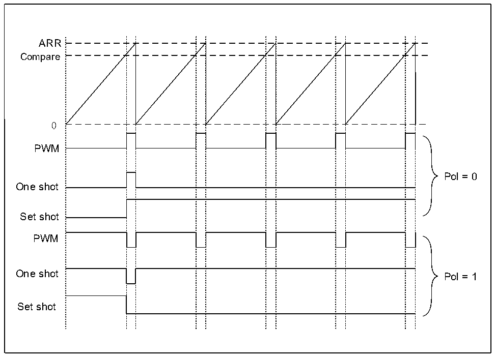

<!-- source-page: 230 -->

[← p.229](0229.md) · [index](../README.md) · [PDF p.230](https://ch32-riscv-ug.github.io/CH32L103/datasheet_en/CH32L103RM.PDF#page=230) · [p.231 →](0231.md)

<!-- header: CH32L103 Reference Manual https://wch-ic.com -->

Figure 16-6 Waveform generation  
 <!-- rendered from the PDF; verify at https://ch32-riscv-ug.github.io/CH32L103/datasheet_en/CH32L103RM.PDF#page=230 -->

🖼 Text parsed from the figure above

ARR  
Compare  
0  
PWM  
Pol = 0  
One shot  
Set shot  
PWM  
One shot Pol = 1  
Set shot  

### 16.3.8 Register Update

The LPTIM_ARR register and the LPTIM_CMP register are updated immediately after the PB bus write  
operation, or if the timer has been started, at the end of the current cycle.  
The PRELOAD bit controls how the LPTIM_ARR and LPTIM_CMP registers are updated:  
When the PRELOAD bit is set to 0, the LPTIM_ARR and LPTIM_CMP registers are updated immediately after  
any write access.  
When the PRELOAD bit is set to 1, the LPTIM_ARR and LPTIM_CMP registers are updated at the end of the  
current cycle if the timer has been started.  
The LPTIM PB interface and LPTIM logic use different clocks, so there is some delay between PB writes and the  
values available to counter comparators, during which any additional writes to these registers must be avoided.  
The ARROK flag and the CMPOK flag in the LPTIM_ISR register indicate when to complete the writing  
operation to the LPTIM_ARR register and the LPTIM_CMP register, respectively.  
After writing to the LPTIM_ARR register or LPTIM_CMP register, a new write operation to the same register can  
be performed only when the previous write operation is completed.  
Any consecutive writes before setting the ARROK flag or the CMPOK flag will result in unpredictable results.  

### 16.3.9 Counter Mode

LPTIM counters can be used to count external events on the LPTIM_CH1 as well as internal clock cycles. The  
<!-- image: p230-draw-image-00001 bbox=[515.76, 783.48, 535.2, 793.8] -->
<!-- footer: V2.2 228 -->
