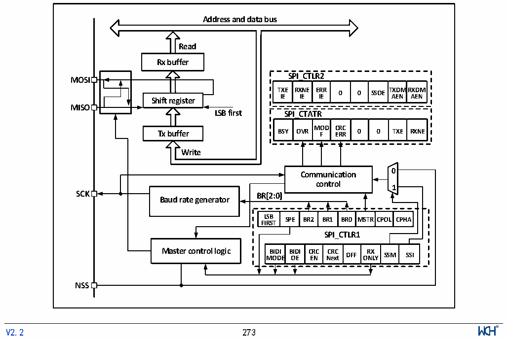

<!-- source-page: 275 -->

[← p.274](0274.md) · [index](../README.md) · [PDF p.275](https://ch32-riscv-ug.github.io/CH32L103/datasheet_en/CH32L103RM.PDF#page=275) · [p.276 →](0276.md)

<!-- header: CH32L103 Reference Manual https://wch-ic.com -->

# Chapter 19 Serial Peripheral Interface (SPI)

SPI supports data exchange in three-wire synchronous serial mode, plus chip line selection supports hardware  
switching between master and slave modes, and supports communication with a single data line.  

## 19.1 Main Features

### 19.1.1 SPI Features

● Support full-duplex synchronous serial mode  
● Support 1-wire half-duplex mode  
● Support master mode and slave mode, multi-slave mode  
● Support 8-bit or 16-bit data structures  
● The highest clock frequency is supported to half of Fpclk  
● Data ordering supports MSB or LSB first  
● Support hardware or software control of the NSS pin  
● Transceiver supports hardware CRC  
● Transceiver buffer supports DMA transfer  
● Support modifying clock phase and polarity  

## 19.2 SPI Functional Description

### 19.2.1 Overview

Figure 19-1 SPI structure diagram  
 <!-- rendered from the PDF; verify at https://ch32-riscv-ug.github.io/CH32L103/datasheet_en/CH32L103RM.PDF#page=275 -->

🖼 Text parsed from the figure above

<strong>Address and data bus</strong>  
<!-- image: p275-draw-image-00004 inside the figure -->
<strong>Read</strong>  
<strong>Rx buffer</strong>  
<strong>SPI_CTLR2</strong>  
<strong>MOSI</strong>  
<strong>TXE RXNE ERR TXDMRXDM</strong>  
<strong>0 0 SSOE</strong>  
<strong>IE IE IE AEN AEN</strong>  
<strong>Shift register</strong>  
<strong>MISO</strong>  
<strong>LSB first SPI_CTATR</strong>  
<strong>MOD CRC</strong>  
<strong>Tx buffer BSY OVR F ERR 0 0 TXE RXNE</strong>  
<strong>Write</strong>  
<!-- image: p275-draw-image-00002 inside the figure -->
<!-- image: p275-draw-image-00003 inside the figure -->
<strong>0</strong>  
<strong>Communication</strong>  
<strong>control</strong>  
<strong>1</strong>  
<strong>SCK BR[2:0]</strong>  
<strong>Baud rate generator</strong>  
BR[2:0]  LSBFIRST  SPE  BR2  BR1  BR0  MSTR  RCPOL  CPHA  
<strong>SPI_CTLR1</strong>  
BIDIMODE  BIDIOE  CRCEN  CRCNext  DFF  RXON  SSMLY  SSI  
<strong>NSS</strong>  
<!-- image: p275-draw-image-00001 inside the figure -->
<!-- footer: V2.2 273 -->

