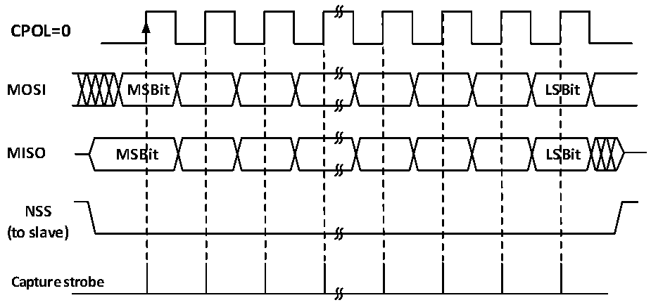
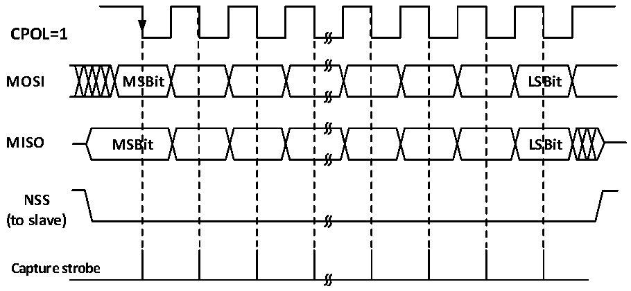

<!-- source-page: 277 -->

[← p.276](0276.md) · [index](../README.md) · [PDF p.277](https://ch32-riscv-ug.github.io/CH32L103/datasheet_en/CH32L103RM.PDF#page=277) · [p.278 →](0278.md)

<!-- header: CH32L103 Reference Manual https://wch-ic.com -->
transferred from the shift register to the receive buffer in parallel, the RXNE bit is set, and if the RXNEIE bit was  
previously set, it will also generate interrupt. At this time, the data register should be read as soon as possible to  
remove the data.  

Figure 19-2 SPI master mode read/write mode 0  
 <!-- rendered from the PDF; verify at https://ch32-riscv-ug.github.io/CH32L103/datasheet_en/CH32L103RM.PDF#page=277 -->

# MODE 0

# CPHA=0

🖼 Text parsed from the figure above

<strong>CPOL=0</strong>  
<strong>MOSI MSBit LSBit</strong>  
<strong>MISO MSBit LSBit</strong>  
<strong>NSS</strong>  
<strong>(to slave)</strong>  
<strong>Capture strobe</strong>  

Figure 19-3 SPI master mode read/write mode 1  
 <!-- rendered from the PDF; verify at https://ch32-riscv-ug.github.io/CH32L103/datasheet_en/CH32L103RM.PDF#page=277 -->

# MODE 1

# CPHA=0

🖼 Text parsed from the figure above

<strong>CPOL=1</strong>  
<strong>MOSI MSBit LSBit</strong>  
<strong>MISO MSBit LSBit</strong>  
<strong>NSS</strong>  
<strong>(to slave)</strong>  
<strong>Capture strobe</strong>  

<!-- image: p277-draw-image-00001 bbox=[515.76, 783.48, 535.2, 793.8] -->
<!-- footer: V2.2 275 -->
