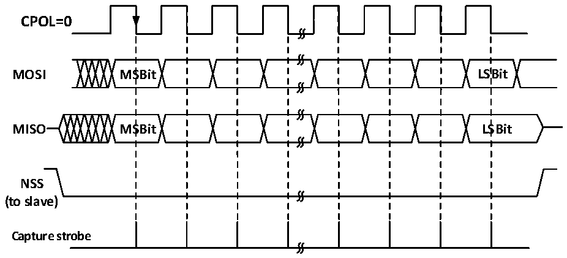
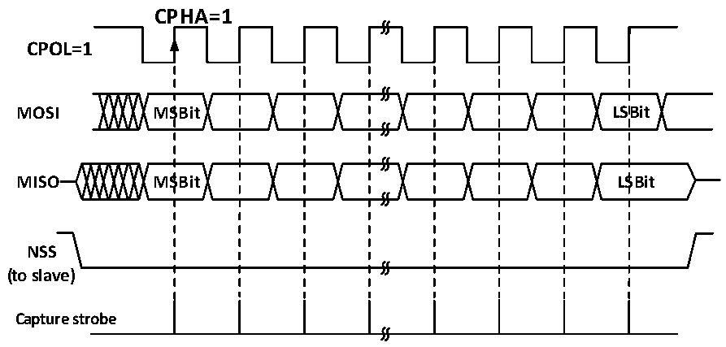

<!-- source-page: 278 -->

[← p.277](0277.md) · [index](../README.md) · [PDF p.278](https://ch32-riscv-ug.github.io/CH32L103/datasheet_en/CH32L103RM.PDF#page=278) · [p.279 →](0279.md)

<!-- header: CH32L103 Reference Manual https://wch-ic.com -->

Figure 19-4 SPI master mode read/write mode 2  
 <!-- rendered from the PDF; verify at https://ch32-riscv-ug.github.io/CH32L103/datasheet_en/CH32L103RM.PDF#page=278 -->

# MODE 2

# CPHA=1

🖼 Text parsed from the figure above

<strong>CPOL=0</strong>  
<strong>MOSI MSBit LSBit</strong>  
<strong>MISO MSBit LSBit</strong>  
<strong>NSS</strong>  
<strong>(to slave)</strong>  
<strong>Capture strobe</strong>  

Figure 19-5 SPI master mode read/write mode 3  
 <!-- rendered from the PDF; verify at https://ch32-riscv-ug.github.io/CH32L103/datasheet_en/CH32L103RM.PDF#page=278 -->

# MODE 3

🖼 Text parsed from the figure above

CPHA=1  
<strong>CPOL=1</strong>  
<strong>MOSI MSBit LSBit</strong>  
<strong>MISO MSBit LSBit</strong>  
<strong>NSS</strong>  
<strong>(to slave)</strong>  
<strong>Capture strobe</strong>  

### 19.2.3 Slave Mode

When the SPI module works in slave mode, SCK is used to receive the clock sent by the host, and its own baud  
rate setting is invalid. The steps to configure into slave mode are as follows:  
Configure the DEF bit to set the data bit length;  
Configure CPHA to match the host operating mode;  
Determine the SPI operating mode based on the transmitting and receiving configurations and CPOL;  
If transmitting in slave mode is required, CPOL needs to be set and configured as mode 2 or mode 3, and the host  
changes the configuration as required;  
If only receiving in slave mode is required, only the host CPOL mode needs to be matched;  
<!-- image: p278-draw-image-00001 bbox=[515.76, 783.48, 535.2, 793.8] -->
<!-- footer: V2.2 276 -->
