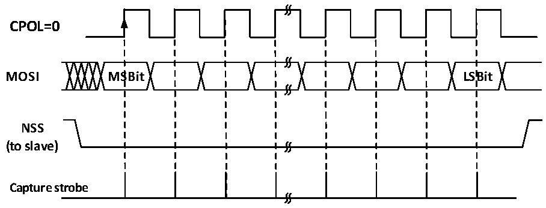

<!-- source-page: 279 -->

[← p.278](0278.md) · [index](../README.md) · [PDF p.279](https://ch32-riscv-ug.github.io/CH32L103/datasheet_en/CH32L103RM.PDF#page=279) · [p.280 →](0280.md)

<!-- header: CH32L103 Reference Manual https://wch-ic.com -->
Configure LSBFIRST to match the host data frame format;  
In hardware management mode, the NSS pin needs to be kept at a low level. If NSS is set to software  
management (SSM is set), then please keep SSI not set;  
Clear the MSTR bit and set the SPE bit to enable SPI mode.  
When transmitting, when the first slave receive sampling edge occurs on SCK, the slave starts to transmit. The  
process of sending is to move the data in the send buffer to the send shift register. When the data in the send buffer  
is moved to the shift register, the TXE flag will be set. If the TXEIE bit was previously set, an interrupt will be  
generated.  
When receiving, after the last clock sampling edge, the RXNE bit is set, the byte received by the shift register is  
transferred to the receive buffer, and the read operation of the read data register can obtain the data in the receive  
buffer. An interrupt will be generated if RXNEIE is set before RXNE is set.  

Figure 19-6 SPI slave mode read mode 0  
 <!-- rendered from the PDF; verify at https://ch32-riscv-ug.github.io/CH32L103/datasheet_en/CH32L103RM.PDF#page=279 -->

# MODE 0

# CPHA=0

🖼 Text parsed from the figure above

<strong>CPOL=0</strong>  
<strong>MOSI MSBit LSBit</strong>  
<strong>NSS</strong>  
<strong>(to slave)</strong>  
<strong>Capture strobe</strong>  

Figure 19-7 SPI slave mode read mode 1  
 <!-- rendered from the PDF; verify at https://ch32-riscv-ug.github.io/CH32L103/datasheet_en/CH32L103RM.PDF#page=279 -->

# MODE 1

# CPHA=0

🖼 Text parsed from the figure above

<strong>CPOL=1</strong>  
<strong>MOSI MSBit LSBit</strong>  
<strong>NSS</strong>  
<strong>(to slave)</strong>  
<strong>Capture strobe</strong>  

<!-- image: p279-draw-image-00001 bbox=[515.76, 783.48, 535.2, 793.8] -->
<!-- footer: V2.2 277 -->
