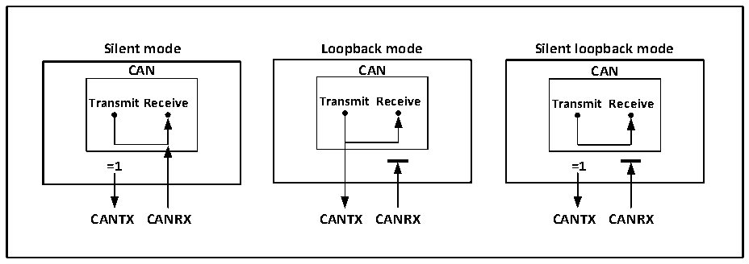

<!-- source-page: 315 -->

[← p.314](0314.md) · [index](../README.md) · [PDF p.315](https://ch32-riscv-ug.github.io/CH32L103/datasheet_en/CH32L103RM.PDF#page=315) · [p.316 →](0316.md)

<!-- header: CH32L103 Reference Manual https://wch-ic.com -->
mode is usually used for the closed self-test of the CAN controller. In this mode, it has no effect on the CAN bus,  
the RX pin is disconnected from the bus, and the TX pin is set to a recessive bit.  

Figure 22-2 CAN 3 test modes of the bus  
 <!-- rendered from the PDF; verify at https://ch32-riscv-ug.github.io/CH32L103/datasheet_en/CH32L103RM.PDF#page=315 -->

🖼 Text parsed from the figure above

<strong>Silent mode Loopback mode Silent loopback mode</strong>  
<strong>CAN CAN CAN</strong>  
<strong>TransmitReceive Transmit Receive Transmit Receive</strong>  
<strong>=1 =1</strong>  
<strong>CANTX CANRX CANTX CANRX CANTX CANRX</strong>  

## 22.4 MCU Operating State of CAN Controller in Debug Mode

When the MCU enters the debug mode, the core is in a suspended state, but it can be determined whether the  
CAN controller is in a normal operation or a stop state through the configuration bits in the debug module.  

## 22.5 CAN Controller Functional Description

### 22.5.1 Transmit Processing Flow

The transmit processing flow is as follows: If there are vacant mailboxes among the 3 sending mailboxes, the  
application layer software only has write access to the registers of the vacant mailboxes, and operates the registers  
CAN1_TXMIRx, CAN1_TXMDTRx, CAN1_TXMDLRx and CAN1_TXMDHRx, and can set the message  
identifier, message length, time stamp, and message data. After the data is ready, the TXRQ bit of the register  
CAN1_TXMIRx is set to 1 to request transmission, the mailbox enters the registered state, and the priority is  
queued; once it becomes the highest priority mailbox, it becomes the scheduled transmission state and waits for  
the CAN bus to be idle; when the CAN bus is idle When the message is scheduled to be sent, the message of the  
mailbox will enter the sending state immediately; after the message is sent, the mailbox will become a vacant  
mailbox again, and the RQCP and TXOK bits of the register CAN1_TSTATR are set to 1 to indicate that the  
sending is successful; if the arbitration fails during sending, the ALST of the register CAN1_TSTATR Set to 1,  
TERR set to 1 if an error is sent.  

### 22.5.2 Transmit Priority

The transmit priority can be determined by the identifier or the order of sending requests. The TXFP position of  
the register CAN1_CTLR is 1 and sent according to the order of sending requests. According to the order of  
sending requests, it is mainly used for segmented sending; the TXFP bit is cleared to 0 and sent according to the  
priority of the identifier. In order, the smaller the identifier is, the higher the priority is. In the case of the same  
identifier, the mailbox with the lower number has a higher priority.  

### 22.5.3 Transmit Abort Processing

If the ABRQ bit in the register CAN1_TSTATR is set, the transmission request can be aborted. When the mailbox  
<!-- image: p315-draw-image-00001 bbox=[515.76, 783.48, 535.2, 793.8] -->
<!-- footer: V2.2 313 -->
