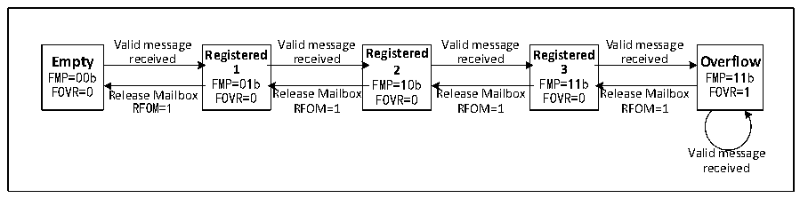

<!-- source-page: 317 -->

[← p.316](0316.md) · [index](../README.md) · [PDF p.317](https://ch32-riscv-ug.github.io/CH32L103/datasheet_en/CH32L103RM.PDF#page=317) · [p.318 →](0318.md)

<!-- header: CH32L103 Reference Manual https://wch-ic.com -->
registered 2 state is returned; if the registered 3 state is not If the mailbox is released, when the next valid packet is  
received, packet loss will inevitably occur.  

Figure 22-3 Receive FIFO state switching diagram  
 <!-- rendered from the PDF; verify at https://ch32-riscv-ug.github.io/CH32L103/datasheet_en/CH32L103RM.PDF#page=317 -->

🖼 Text parsed from the figure above

Valid message Valid message Valid message Valid message  
Empty received Registered received Registered received Registered received Overflow  
FMP=00b 1 2 3 FMP=11b  
FMP=01b FMP=10b FMP=11b  
FOVR=0 Release Mailbox FOVR=0 Release Mailbox FOVR=0 Release Mailbox FOVR=0 Release Mailbox FOVR=1  
RFOM=1 RFOM=1 RFOM=1 RFOM=1  
Valid message  
received  

In the case of message loss above, that is, the receiving FIFO is full, and the message overflow causes the  
message to be lost. The FOVR bit of the receiving FIFO register CAN1_RFIFOx will be automatically set to 1 by  
hardware for overflow query. When the RFLM bit of the register CAN1_CTLR is set to 1, the receiving FIFO  
locking function is enabled, and the discarded message is a new received message; when the RFLM bit of the  
register CAN1_CTLR is cleared to 0, the receiving FIFO locking function is disabled. Among the 3 original  
messages of the receiving FIFO, the last received message will be overwritten by the new message.  
When the relevant bit of the register CAN1_INTENR is set, an interrupt can be generated when the state of the  
receiving FIFO is switched, so as to process the received message more efficiently, see section 22.6 CAN interrupt  
for details.  

### 24.5.6 Error Handling

The CAN controller relies on the state error register CAN1_ERRSR to manage errors on the bus. The TEC and  
REC in the state error register CAN1_ERRSR represent the sending and receiving error count values respectively.  
According to the increase of the sending and receiving errors and the decrease of the sending and receiving  
success, the stability of the CAN bus can be judged according to their values.  
When the TEC and REC in the state error register CAN1_ERRSR are less than 128, the current CAN node is in an  
error active state, can normally participate in bus communication, and issue an active error flag when an error is  
detected.  
When the TEC and REC in the state error register CAN1_ERRSR are greater than 127, the current CAN node is  
in an error passive state, and when an error is detected, it is not allowed to issue an active error flag, but can only  
issue a passive error flag.  
When the TEC in the status error register CAN1_ERRSR is greater than 255, the current CAN node goes offline.  
When the bus monitors 11 consecutive hidden bits for 128times, it returns to the error active state, and the  
recovery mode is affected by the ABOM bit in the main control register CAN1_CTLR. If ABOM is set to 1, the  
hardware automatically exits the offline state. If ABOM is 0, the software needs to operate the INRQ bit to enter  
the initialization mode, and then exit the initialization before exiting the offline state.  
<!-- image: p317-draw-image-00001 bbox=[515.76, 783.48, 535.2, 793.8] -->
<!-- footer: V2.2 315 -->
