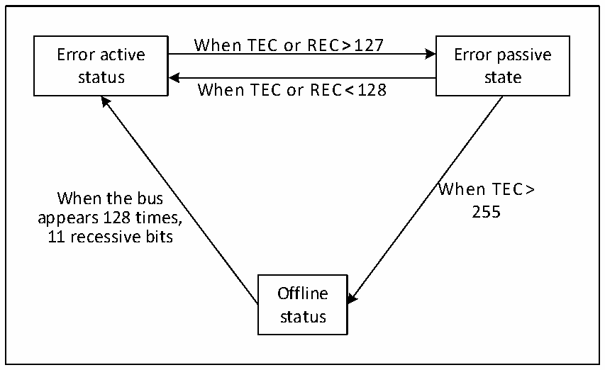

<!-- source-page: 318 -->

[← p.317](0317.md) · [index](../README.md) · [PDF p.318](https://ch32-riscv-ug.github.io/CH32L103/datasheet_en/CH32L103RM.PDF#page=318) · [p.319 →](0319.md)

<!-- header: CH32L103 Reference Manual https://wch-ic.com -->

Figure 22-4 CAN error state switch diagram  
 <!-- rendered from the PDF; verify at https://ch32-riscv-ug.github.io/CH32L103/datasheet_en/CH32L103RM.PDF#page=318 -->

🖼 Text parsed from the figure above

When TEC or REC&gt;127  
Error active Error passive  
status state  
When TEC or REC&lt;128  
When TEC&gt;  
When the bus  
255  
appears 128 times,  
11 recessive bits  
Offline  
status  

### 22.5.7 Bit Timing

According to the standard of CAN bus, each bit time is divided into four segments: synchronization segment,  
propagation time segment, phase buffer segment 1 and phase buffer segment 2. These segments consist of the  
minimum time unit Tq. The CAN controller monitors the CAN bus change by sampling and synchronizes through  
the edge of the start bit of the frame.  
The CAN controller re-divides the above four segments into 3 segments, which are:  
● Synchronization segment (SS): the synchronization segment in the CAN standard is fixed as a minimum time  
unit, and the expected bit jump normally occurs within this period of time.  
● Time period 1 (BS1): contains the propagation time period and phase buffer section 1 in the CAN standard,  
which can be set to contain 1 to 16 minimum time units and can be automatically extended to compensate for  
the positive phase drift caused by frequency accuracy errors of different nodes on the CAN bus. The end of  
the time period is the location of the sampling point.  
● Time period 2 (BS2): phase buffer section 2 in the CAN standard can be set to 1 to 8 minimum time units and  
can be automatically shortened to compensate for the negative phase drift caused by frequency accuracy  
errors of different nodes on the CAN bus.  
Resynchronization jump width (SJW) is the upper limit of the minimum number of time units that can be  
extended and reduced per person, and the range can be set to 1 to 4 minimum time units.  
The above parameters can be configured in the CAN bus timing register CAN1_BTIMR.  
<!-- image: p318-draw-image-00001 bbox=[515.76, 783.48, 535.2, 793.8] -->
<!-- footer: V2.2 316 -->
