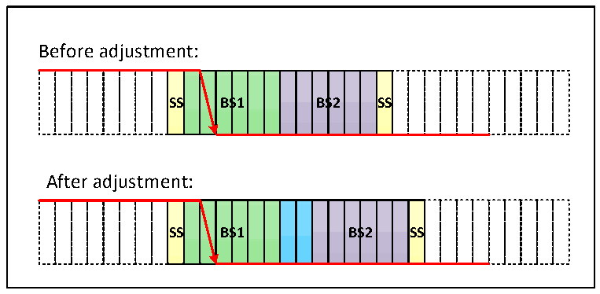
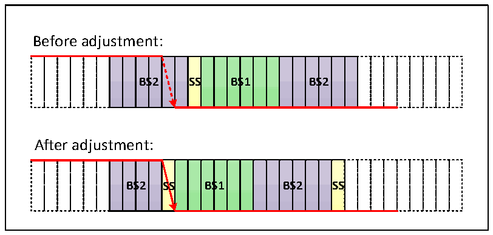

<!-- source-page: 319 -->

[← p.318](0318.md) · [index](../README.md) · [PDF p.319](https://ch32-riscv-ug.github.io/CH32L103/datasheet_en/CH32L103RM.PDF#page=319) · [p.320 →](0320.md)

<!-- header: CH32L103 Reference Manual https://wch-ic.com -->

Figure 22-5 The jump appears in BS1  
 <!-- rendered from the PDF; verify at https://ch32-riscv-ug.github.io/CH32L103/datasheet_en/CH32L103RM.PDF#page=319 -->

🖼 Text parsed from the figure above

Before adjustment:  
<!-- image: p319-draw-image-00002 inside the figure -->
<!-- image: p319-draw-image-00003 inside the figure -->
<!-- image: p319-draw-image-00004 inside the figure -->
<!-- image: p319-draw-image-00005 inside the figure -->
<!-- image: p319-draw-image-00015 inside the figure -->
<!-- image: p319-draw-image-00006 inside the figure -->
<!-- image: p319-draw-image-00007 inside the figure -->
<!-- image: p319-draw-image-00008 inside the figure -->
<!-- image: p319-draw-image-00009 inside the figure -->
<!-- image: p319-draw-image-00010 inside the figure -->
<!-- image: p319-draw-image-00011 inside the figure -->
<!-- image: p319-draw-image-00012 inside the figure -->
<!-- image: p319-draw-image-00013 inside the figure -->
<!-- image: p319-draw-image-00014 inside the figure -->
SS  BS  S1  BS  S2  SS  
After adjustment:  
<!-- image: p319-draw-image-00016 inside the figure -->
<!-- image: p319-draw-image-00017 inside the figure -->
<!-- image: p319-draw-image-00018 inside the figure -->
<!-- image: p319-draw-image-00019 inside the figure -->
<!-- image: p319-draw-image-00029 inside the figure -->
<!-- image: p319-draw-image-00020 inside the figure -->
<!-- image: p319-draw-image-00021 inside the figure -->
<!-- image: p319-draw-image-00022 inside the figure -->
<!-- image: p319-draw-image-00023 inside the figure -->
<!-- image: p319-draw-image-00024 inside the figure -->
<!-- image: p319-draw-image-00025 inside the figure -->
<!-- image: p319-draw-image-00026 inside the figure -->
<!-- image: p319-draw-image-00027 inside the figure -->
<!-- image: p319-draw-image-00028 inside the figure -->
<!-- image: p319-draw-image-00030 inside the figure -->
<!-- image: p319-draw-image-00031 inside the figure -->
SS  BS  S1  BS  S2  SS  

If the SJW of figure 22-5 is 2, and the bus level jump is detected in time period 1, the length of time period 1  
needs to be extended, with a maximum extension of SJW, thus delaying the position of the sampling point.  

Figure 22-6 The jump appears in BS2  
 <!-- rendered from the PDF; verify at https://ch32-riscv-ug.github.io/CH32L103/datasheet_en/CH32L103RM.PDF#page=319 -->

🖼 Text parsed from the figure above

Before adjustment:  
<!-- image: p319-draw-image-00032 inside the figure -->
<!-- image: p319-draw-image-00033 inside the figure -->
<!-- image: p319-draw-image-00034 inside the figure -->
<!-- image: p319-draw-image-00035 inside the figure -->
<!-- image: p319-draw-image-00036 inside the figure -->
<!-- image: p319-draw-image-00037 inside the figure -->
<!-- image: p319-draw-image-00047 inside the figure -->
<!-- image: p319-draw-image-00038 inside the figure -->
<!-- image: p319-draw-image-00039 inside the figure -->
<!-- image: p319-draw-image-00040 inside the figure -->
<!-- image: p319-draw-image-00041 inside the figure -->
<!-- image: p319-draw-image-00042 inside the figure -->
<!-- image: p319-draw-image-00043 inside the figure -->
<!-- image: p319-draw-image-00044 inside the figure -->
<!-- image: p319-draw-image-00045 inside the figure -->
<!-- image: p319-draw-image-00046 inside the figure -->
<!-- image: p319-draw-image-00048 inside the figure -->
<!-- image: p319-draw-image-00049 inside the figure -->
<!-- image: p319-draw-image-00050 inside the figure -->
BS  S2  SS  S  BS  S1  BS  S2  
After adjustment:  
<!-- image: p319-draw-image-00051 inside the figure -->
<!-- image: p319-draw-image-00052 inside the figure -->
<!-- image: p319-draw-image-00053 inside the figure -->
<!-- image: p319-draw-image-00054 inside the figure -->
<!-- image: p319-draw-image-00055 inside the figure -->
<!-- image: p319-draw-image-00056 inside the figure -->
<!-- image: p319-draw-image-00066 inside the figure -->
<!-- image: p319-draw-image-00057 inside the figure -->
<!-- image: p319-draw-image-00058 inside the figure -->
<!-- image: p319-draw-image-00059 inside the figure -->
<!-- image: p319-draw-image-00060 inside the figure -->
<!-- image: p319-draw-image-00061 inside the figure -->
<!-- image: p319-draw-image-00062 inside the figure -->
<!-- image: p319-draw-image-00063 inside the figure -->
<!-- image: p319-draw-image-00064 inside the figure -->
<!-- image: p319-draw-image-00065 inside the figure -->
<!-- image: p319-draw-image-00067 inside the figure -->
<!-- image: p319-draw-image-00068 inside the figure -->
B  BS2  SS  S  BS  S1  BS  S2  SS  S  

If the SJW of figure 22-6 is 2 and the bus level jump is detected in time period 2, it is necessary to reduce the  
length of time period 2 and the maximum SJW, so as to advance the position of the sampling point.  

## 22.6 CAN Interrupt

The CAN controller has 3 interrupt vectors, which are send interrupt, FIFO_0 interrupt, error and state change  
interrupt.  
Set the CAN interrupt allow register CAN1_INTENR to allow or disable each interrupt source.  
The sending interrupt is caused by the sending mailbox empty event. After the interrupt is generated, the RQCP0,  
RQCP1 and RQCP2 bits of the register CAN1_TSTATR are queried to determine which mailbox empty event is  
generated.  
FIFO0 interrupts are caused by receiving new messages, receiving mailbox fullness and overflow events. After the  
interrupts are generated, the FMP0, FULL0 and FOVER0 bits of register CAN1_RFIFO0 are queried to determine  
which mailbox emptiness event is generated.  
<!-- image: p319-draw-image-00001 bbox=[515.76, 783.48, 535.2, 793.8] -->
<!-- footer: V2.2 317 -->
