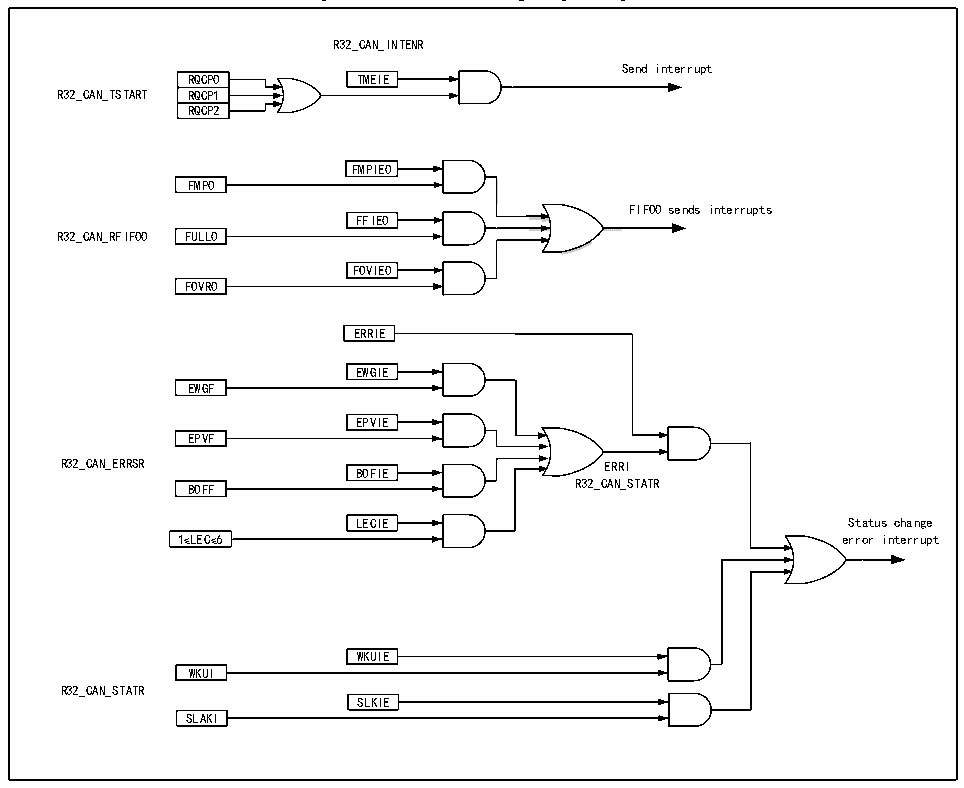

<!-- source-page: 320 -->

[← p.319](0319.md) · [index](../README.md) · [PDF p.320](https://ch32-riscv-ug.github.io/CH32L103/datasheet_en/CH32L103RM.PDF#page=320) · [p.321 →](0321.md)

<!-- header: CH32L103 Reference Manual https://wch-ic.com -->
Errors and state change interruptions are caused by errors, arousal, and sleep events.  

Figure 22-7 CAN interrupt logic diagram  
 <!-- rendered from the PDF; verify at https://ch32-riscv-ug.github.io/CH32L103/datasheet_en/CH32L103RM.PDF#page=320 -->

🖼 Text parsed from the figure above

R32_CAN_INTENR  
Send interrupt  
RQCP0  RQCP1  RQCP2  
RQCP0 TMEIE  
R32_CAN_TSTART RQCP1  
FMPIE0  
<!-- image: p320-draw-image-00002 inside the figure -->
FMP0  
FIFO0 sends interrupts  
FFIE0  
R32_CAN_RFIF00 FULL0  
FOVIE0  
FOVR0  
ERRIE  
EWGIE  
EWGF  
<!-- image: p320-draw-image-00004 inside the figure -->
EPVIE  
EPVF  
<!-- image: p320-draw-image-00003 inside the figure -->
R32_CAN_ERRSR ERRI  
<!-- image: p320-draw-image-00005 inside the figure -->
BOFIE  
BOFF R32_CAN_STATR  
<!-- image: p320-draw-image-00006 inside the figure -->
LECIE  
LECIE Status change  
1≤LEC≤6 error interrupt  
WKUIE  
WKUI  
R32_CAN_STATR  
SLKIE  
SLAKI  

## 22.7 CAN FD Function Description

### 22.7.1 FD Frame Operation

1) Transmitting FD frames:  
Just configure the [7:0] bit of the CANFD_CR register as 0x0F, fill the CANFD_DMA_T0/1/2 buffer of the  
corresponding mailbox into the sending data, and configure the DMA address, you can send out the frame in FD  
format, and other registers can be configured as needed.  
2) Receiving FD frames:  
Simply configure the CANFD_DMA_R0 address corresponding to the receiving FIFO and configure the  
CANFD_BTR register to the correct bit rate to receive the FD frame.  
In the FDCAN format, the coding of DLC differs from the standard CAN format. The coding of DLC codes 0  
through 8 is the same as that of standard CAN, while the coding of codes 9 through 15 (which all encode an  
8-byte data field in standard CAN) is different from that of standard CAN, as shown in the table.  

<!-- p320-table-003 (table-22-5@1) pages 320-321 -->
<table><caption>Table 22-5 DLC Coding in CAN FD Mode</caption><tr><th>DLC</th><th>9</th><th>10</th><th>11</th><th>12</th><th>13</th><th>14</th><th>15</th></tr><tr><td style="text-align:left">Data byte count</td><td>12</td><td>16</td><td>20</td><td>24</td><td>32</td><td>48</td><td>64</td></tr></table>

<!-- image: p320-draw-image-00001 bbox=[515.76, 783.48, 535.2, 793.8] -->
<!-- footer: V2.2 318 -->
