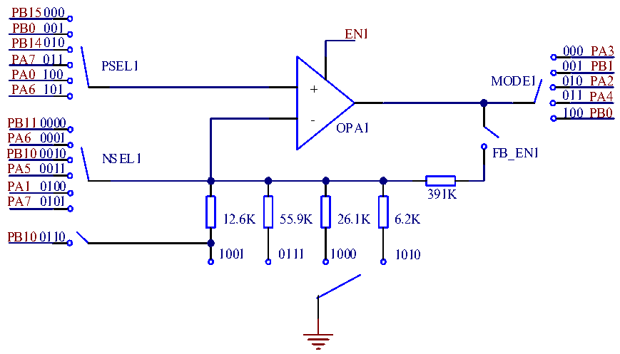

<!-- source-page: 342 -->

[← p.341](0341.md) · [index](../README.md) · [PDF p.342](https://ch32-riscv-ug.github.io/CH32L103/datasheet_en/CH32L103RM.PDF#page=342) · [p.343 →](0343.md)

<!-- header: CH32L103 Reference Manual https://wch-ic.com -->

# Chapter 23 Operational Amplifier (OPA) and Comparator (CMP)

The module consists of an independently configurable operational amplifier (OPA or PGA) and three  
independently configurable voltage comparators (CMP). The operational amplifier (OPA or PGA) supports gain  
selection or can be used as a voltage comparator.  
The input and output of each operational amplifier are connected to the I/O port, and the input pin or gain is  
optional, and the output pin can be optionally configured to the universal I/O port or multiplexed as an ADC  
sampling channel. The external analog small signal is amplified into the ADC to achieve small-signal ADC  
conversion.  
The input and output of each voltage comparator are connected to the I/O port, and the input pins are optional, and  
the output pins can be optionally configured to the universal I/O port or multiplexed as an TIM internal sampling  
channel (without using the I/O pin).  

## 23.1 Main Features

● OPA input pin or channel can be selected.  
● OPA output pin can choose universal I/O port or ADC sampling channel.  
● OPA supports front-end input polling.  
● OPA supports PGA gain selection.  
● CMP input pin is optional, negative input channel optional common pin.  
● CMP output pin can choose universal I/O port or TIM internal sampling channel.  
● OPA interrupt wakes system from sleep mode  
● CMP interrupt wakes the system from sleep and stop modes  

## 23.2 Function Description

### 23.2.1 OPA

Set the EN1 in the OPA_CTLR1 register to enable the corresponding OPA1, configure the MODE1 in the  
OPA_CTLR1 register to choose the output channel of the OPA1 as the ADC sampling channel or the ordinary  
Imax O port, configure the PSEL1 in the OPA_CTLR1 register, select the positive input pin of the OPA1,  
configure the NSEL1 in the OPA_CTLR1 register, choose the negative input channel of the OPA1, or be used as  
the gain when the PGA is used.  

Figure 23-1 OPA Structure  
 <!-- rendered from the PDF; verify at https://ch32-riscv-ug.github.io/CH32L103/datasheet_en/CH32L103RM.PDF#page=342 -->

<!-- image: p342-draw-image-00001 bbox=[515.76, 783.48, 535.2, 793.8] -->
<!-- footer: V2.2 340 -->
