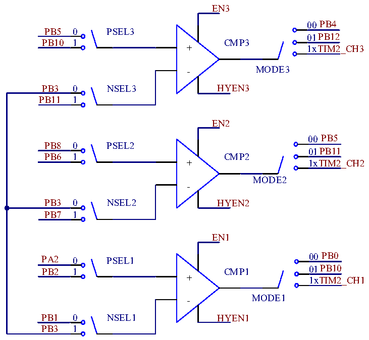

<!-- source-page: 344 -->

[← p.343](0343.md) · [index](../README.md) · [PDF p.344](https://ch32-riscv-ug.github.io/CH32L103/datasheet_en/CH32L103RM.PDF#page=344) · [p.345 →](0345.md)

<!-- header: CH32L103 Reference Manual https://wch-ic.com -->
high.  

### 23.2.4 OPA Reset

After enabling the OPA function, set RST_EN=1 to turn on the OPA reset function, and the system is reset when  
the OPA output is high.  

### 23.2.5 OPA Brake

The brake signal source can be selected by setting the BKIN_EN bit in the OPA_CFGR1 register. When  
BKIN_EN=1, the brake source of TIM1 comes from OPA, and at this time, it is invalid to use the IO pin for  
braking; the brake input polarity is valid when and only when the OPA output is high.  

### 23.2.6 CMP

Set the ENx in the OPA_CTLR2 register to enable the corresponding CMPx, and configure the MODEx in the  
OPA_CTLR2 register to choose the output channel of the CMPx as the ordinary Icano port or the internal timer  
channel. Configure the PSELx in the OPA_CTLR2 register, select the positive input pin of the CMPx, configure  
the NSELx in the OPA_CTLR2 register, and select the negative input pin of the CMPx.  

Figure 23-2 CMP Structure Diagram  
 <!-- rendered from the PDF; verify at https://ch32-riscv-ug.github.io/CH32L103/datasheet_en/CH32L103RM.PDF#page=344 -->

🖼 Text parsed from the figure above

EN3  
00 PB4  
PB5 0 PSEL3  
01PB12  
PB10 1 CMP3  
+ 1xTIM2_CH3  
MODE3  
PB3 0 NSEL3 HYEN3  
PB11 1  
EN2  
00 PB5  
PB8 0 PSEL2  
01PB11  
PB6 1 CMP2  
+ 1xTIM2_CH2  
MODE2  
-  
PB3 0 NSEL2 HYEN2  
PB7 1  
EN1  
PA2 0 PSEL1 00 PB0  
01PB10  
PB2 1 CMP1  
+ 1xTIM2_CH1  
MODE1  
PB1 0 NSEL1 HYEN1  
PB3 1  

<em>Note: If the comparator output uses a timed channel, capture via timer is used to view the comparator output</em>  
<em>status.</em>  

### 23.2.7 CMP Interrupt

External Interrupt (EXTI) Line Exclusive to Comparator - EXTI22 (COMP Wake-Up Event), which generates an  
<!-- image: p344-draw-image-00001 bbox=[515.76, 783.48, 535.2, 793.8] -->
<!-- footer: V2.2 342 -->
