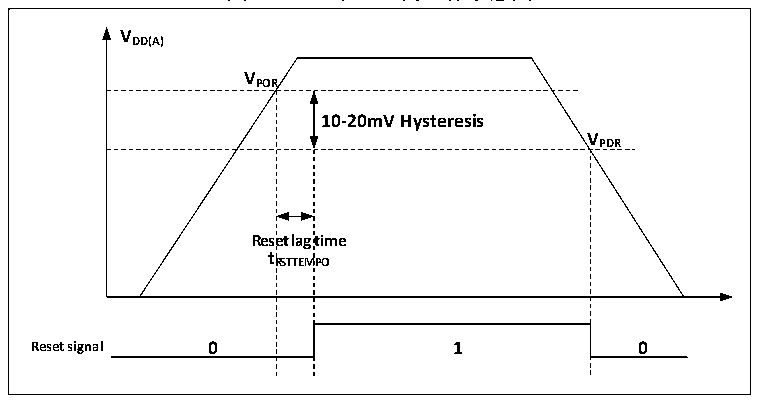
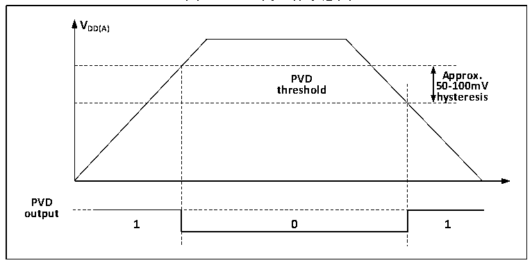

<!-- source-page: 8 -->

[← p.7](0007.md) · [index](../README.md) · [PDF p.8](https://ch32-riscv-ug.github.io/CH32L103/datasheet_zh/CH32L103RM.PDF#page=8) · [p.9 →](0009.md)

<!-- header: CH32L103应用手册 https://wch.cn -->

图2-2 POR和PDR的工作示意图  
 <!-- rendered from the PDF; verify at https://ch32-riscv-ug.github.io/CH32L103/datasheet_zh/CH32L103RM.PDF#page=8 -->

🖼 Text parsed from the figure above

<strong>VDD(A)</strong>  
<strong>VPOR</strong>  
10-20mV Hysteresis  Rese t R  et lag RSTTEM  time MPO  V  
<strong>VPDR</strong>  
<strong>tRSTTEMPO</strong>  
<strong>Reset signal 0 1 0</strong>  

### 2.2.2 可编程电压监测器

可编程电压监测器 PVD，主要被用于监控系统主电源的变化，与电源控制寄存器 PWR_CTLR 的  
PLS[2:0]所设置的门槛电压相比较，配合外部中断寄存器（EXTI）设置，可产生相关中断，以便及  
时通知系统进行数据保存等掉电前操作。  
具体配置如下：  
1） 设置PWR_CTLR寄存器的PLS[2:0]域，选择要监控电压阈值。  
2） 可选的中断处理。PVD功能内部连接EXTI模块的第16线的上升/下降边沿触发设置，开启此中  
断（配置EXTI），当VDD 下降到PVD阈值以下或上升到PVD阈值之上时就会产生PVD中断。  
3） 设置PWR_CTLR寄存器的PVDE位来开启PVD功能。  
4） 读取PWR_CSR状态寄存器的PVD0位可获取当前系统主电源与PLS[2:0]设置阈值关系，执行相应  
软处理。当VDD电压高于PLS[2:0]设置阈值，PVD0位置0；当VDD电压低于PLS[2:0]设置阈值，  
PVD0位置1。  

图2-3 PVD的工作示意图  
 <!-- rendered from the PDF; verify at https://ch32-riscv-ug.github.io/CH32L103/datasheet_zh/CH32L103RM.PDF#page=8 -->

🖼 Text parsed from the figure above

<strong>VDD(A)</strong>  
PVD threshold  0  
<strong>hysteresis</strong>  
<strong>PVD</strong>  
<strong>output</strong>  

## 2.3 低功耗模式

在系统复位后，微控制器处于正常工作状态（运行模式），此时可以通过降低系统主频或者关  
闭不用外设时钟或者降低工作外设时钟来节省系统功耗。如果系统不需要工作，可设置系统进入低  
功耗模式，并通过特定事件让系统跳出此状态。  
微控制器目前提供了3种低功耗模式，从处理器、外设、电压调节器等的工作差异上分为：  
● 睡眠模式：内核停止运行，所有外设（包含内核私有外设）仍在运行。  
<!-- image: p8-draw-image-00001 bbox=[507.84, 786.36, 527.28, 796.68] -->
<!-- footer: V2.2 3 -->
