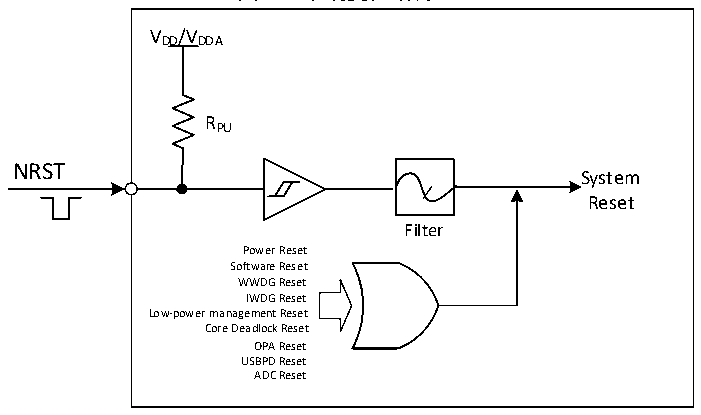

<!-- source-page: 15 -->

[← p.14](0014.md) · [index](../README.md) · [PDF p.15](https://ch32-riscv-ug.github.io/CH32L103/datasheet_zh/CH32L103RM.PDF#page=15) · [p.16 →](0016.md)

<!-- header: CH32L103应用手册 https://wch.cn -->
行复位。  
OPA复位：在OPA复位使能开启的情况下，运放输出高电平会产生OPA复位。  
USBPD复位：当PD_RST_EN为1时，CH32L103支持USB PD信号帧Hard Reset产生的复位；如  
果IE_RX_RESET也为1，则还支持信号帧Cable Reset产生的复位。USB PD没有复位标志，但产生  
的复位效果同软件复位。  
ADC 复位：在 ADC 看门狗复位使能开启的情况下，当 ADC 数据大于看门狗高阈值或者小于看门  
狗低阈值时会产生ADC复位。  

图3-1系统复位结构  
 <!-- rendered from the PDF; verify at https://ch32-riscv-ug.github.io/CH32L103/datasheet_zh/CH32L103RM.PDF#page=15 -->

🖼 Text parsed from the figure above

VDD/VDDA  
RPU  
NRST  
System  
Reset  
Filter  
Power Reset  
Software Reset  
WWDG Reset  
IWDG Reset  
Low-power management Reset  
Core Deadlock Reset  
OPA Reset  
USBPD Reset  
ADC Reset  

### 3.2.3 后备区域复位

后备区域复位发生时，只会复位后备区域寄存器，包括后备寄存器、RCC_BDCTLR 寄存器（RTC  
使能和LSE振荡器）。其产生条件包括：  
● 在VDD 和VBAT 都掉电的前提下，由VDD 或VBAT 上电引起  
● RCC_BDCTLR寄存器的BDRST位置1  
● RCC_PB1PRSTR寄存器的BKPRST位置1  
<!-- image: p15-draw-image-00001 bbox=[507.84, 786.36, 527.28, 796.68] -->
<!-- footer: V2.2 10 -->
