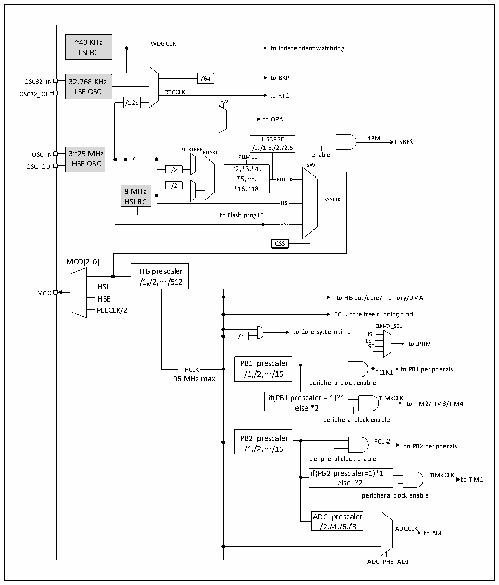

<!-- source-page: 16 -->

[← p.15](0015.md) · [index](../README.md) · [PDF p.16](https://ch32-riscv-ug.github.io/CH32L103/datasheet_zh/CH32L103RM.PDF#page=16) · [p.17 →](0017.md)

<!-- header: CH32L103应用手册 https://wch.cn -->

## 3.3 时钟

### 3.3.1 系统时钟结构

图3-2 时钟树框图  
 <!-- rendered from the PDF; verify at https://ch32-riscv-ug.github.io/CH32L103/datasheet_zh/CH32L103RM.PDF#page=16 -->

🖼 Text parsed from the figure above

~40 KHz IWDGCLK  
to independent watchdog  
LSI RC  
32.768 KHz LSE OSC  
OSC32_IN 32.768 KHz /64 to BKP  
OSC32_OUT LSE OSC RTCCLK to RTC  
/128 SW  
to OPA  
USBPRE 48M USBFS  
OSC_IN 3~25 MHz PLLXTPRE PLLSRC /1,/1.5,/2,/2.5 enable  
3~25 MHz HSE OSC  
PLLMUL  
OSC_OUT HSE OSC /2 *2,*3,*4, SW  
*5,…, PLLCLK  
8 MHz /2 *16,*18  
HSI RC HSI SYSCLK  
to Flash prog IF  
HSE  HSE  
CSS  
MCO[2:0]  
HB prescaler  
/1,/2,…/512  
HSI  
MCO  
HSE to HB bus/core/memory/DMA  
PLLCLK/2  
FCLK core free running clock  
CLKMX_SEL  
/8 to Core System timer HSI  
L L S S E I to LPTIM  
PB1 prescaler  
HCLK /1,/2,…/16 PCLK1 to PB1 peripherals  
96MHz max  
peripheral clock enable  
if(PB1 prescaler = 1)*1 TIMxCLK  
to TIM2/TIM3/TIM4  
else *2  
peripheral clock enable  
PB2 prescaler  
PCLK2  
/1,/2,…/16 to PB2 peripherals  
peripheral clock enable  
if(PB2 prescaler=1)*1 TIMxCLK  
<!-- image: p16-draw-image-00002 inside the figure -->
<!-- image: p16-draw-image-00003 inside the figure -->
else *2 to TIM1  
peripheral clock enable  
ADC prescaler  
/2,/4,/6,/8 ADCCLK  
to ADC  
ADC_PRE_ADJ  

注：当使用USB功能时，CPU的频率必须是48MHz、72MHz或96MHz。当系统从停止或待机模式唤醒  
时系统会自动切换为HSI做主频。  

### 3.3.2 高速时钟（HSI/HSE）

HSI是系统内部8MHz的RC振荡器产生的高速时钟信号。HSI RC振荡器能够在不需要任何外部  
器件的条件下提供系统时钟。它的启动时间很短但时钟频率精度较差。HSI通过设置RCC_CTLR寄存  
器中的HSION位被启动和关闭，HSIRDY位指示HSI RC振荡器是否稳定。系统默认HSION和HSIRDY  
<!-- image: p16-draw-image-00001 bbox=[507.84, 786.36, 527.28, 796.68] -->
<!-- footer: V2.2 11 -->
