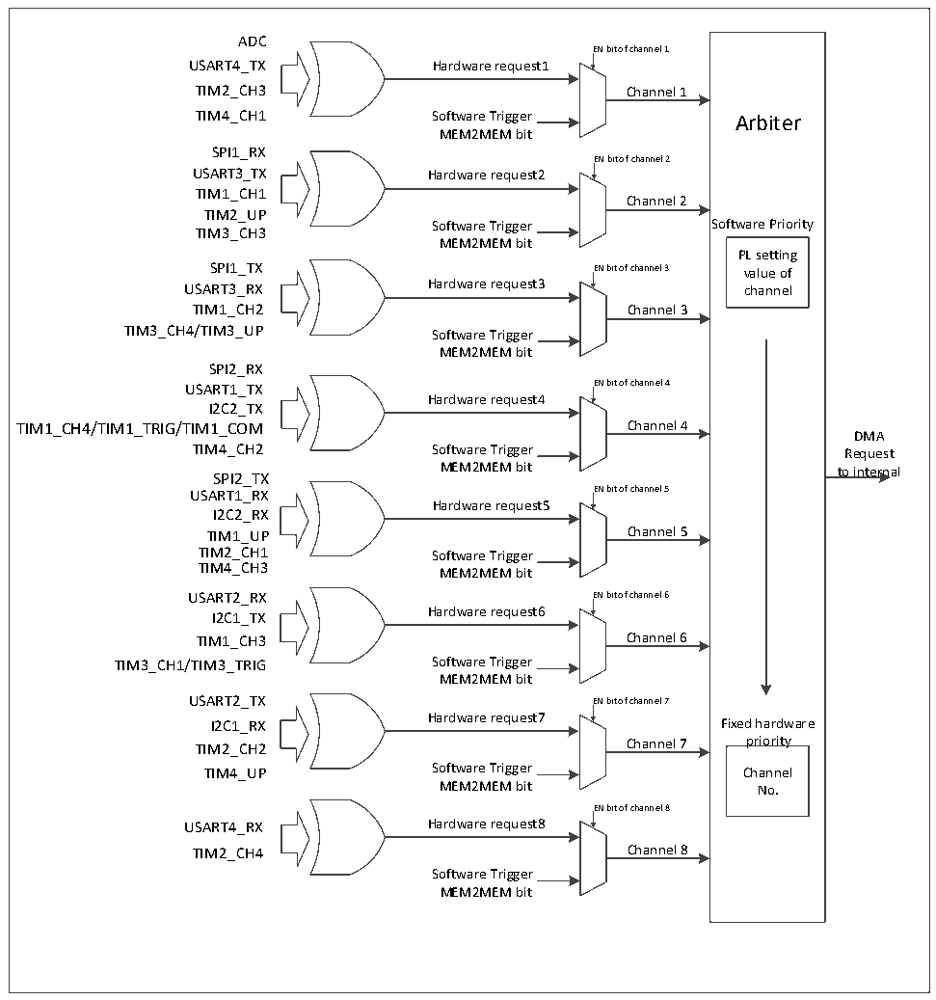

<!-- source-page: 102 -->

[← p.101](0101.md) · [index](../README.md) · [PDF p.102](https://ch32-riscv-ug.github.io/CH32L103/datasheet_zh/CH32L103RM.PDF#page=102) · [p.103 →](0103.md)

<!-- header: CH32L103应用手册 https://wch.cn -->

### 11.2.3 DMA请求映射

图11-1 DMA请求映像  
 <!-- rendered from the PDF; verify at https://ch32-riscv-ug.github.io/CH32L103/datasheet_zh/CH32L103RM.PDF#page=102 -->

🖼 Text parsed from the figure above

ADC  
EN bit of channel 1  
USART4_TX Hardware request1  
TIM2_CH3 Channel 1  
TIM4_CH1 Software Trigger Arbiter  
MEM2MEM bit  
SPI1_RX  
EN bit of channel 2  
USART3_TX Hardware request2  
TIM1_CH1  
Channel 2  
TIM2_UP  
Software Trigger Software Priority  
TIM3_CH3  
MEM2MEM bit  
PL setting  
SPI1_TX EN bit of channel 3 value of  
USART3_RX Hardware request3 channel  
TIM1_CH2 Channel 3  
TIM3_CH4/TIM3_UP Software Trigger  
MEM2MEM bit  
SPI2_RX  
USART1_TX EN bit of channel 4  
Hardware request4  
I2C2_TX  
TIM1_CH4/TIM1_TRIG/TIM1_COM Channel 4  
DMA  
TIM4_CH2 Software Trigger Request  
SPI2_TX MEM2MEM bit to internal  
USART1_RX EN bit of channel 5  
Hardware request5  
I2C2_RX  
TIM1_UP Channel 5  
TIM2_CH1 Software Trigger  
TIM4_CH3  
MEM2MEM bit  
USART2_RX EN bit of channel 6  
I2C1_TX Hardware request6  
TIM1_CH3 Channel 6  
TIM3_CH1/TIM3_TRIG Software Trigger  
MEM2MEM bit  
USART2_TX EN bit of channel 7  
I2C1_RX Hardware request7 Fixed hardware  
TIM2_CH2 Channel 7 priority  
TIM4_UP Software Trigger Channel  
MEM2MEM bit No.  
EN bit of channel 8  
USART4_RX Hardware request8  
TIM2_CH4 Channel 8  
Software Trigger  
MEM2MEM bit  

# DMA 控制器提供 8 个通道，每个通道对应多个外设请求，通过设置相应外设寄存器中对应 DMA

控制位，可以独立的开启或关闭各个外设的DMA功能，具体对应关系如下。  

<!-- p102-table-001 (table-11-1@1) pages 102-103 -->
<table><tr><th>外设</th><th>通道1</th><th>通道2</th><th>通道3</th><th>通道4</th><th>通道5</th><th>通道6</th><th>通道7</th><th>通道8</th></tr><tr><td>ADC</td><td>ADC</td><td></td><td></td><td></td><td></td><td></td><td></td><td></td></tr><tr><td>SPI1</td><td></td><td>SPI1_RX</td><td>SPI1_TX</td><td></td><td></td><td></td><td></td><td></td></tr><tr><td>SPI2</td><td></td><td></td><td></td><td>SPI2_RX</td><td>SPI2_TX</td><td></td><td></td><td></td></tr><tr><td>USART1</td><td></td><td></td><td></td><td>USART1_TX</td><td>USART1_RX</td><td></td><td></td><td></td></tr><tr><td>USART2</td><td></td><td></td><td></td><td></td><td></td><td>USART2_RX</td><td>USART2_TX</td><td></td></tr><tr><td>USART3</td><td></td><td>USART3_TX</td><td>USART3_RX</td><td></td><td></td><td></td><td></td><td></td></tr><tr><td>USART4</td><td>USART4_TX</td><td></td><td></td><td></td><td></td><td></td><td></td><td>USART4_RX</td></tr><tr><td>I2C1</td><td></td><td></td><td></td><td></td><td></td><td>I2C1_TX</td><td>I2C1_RX</td><td></td></tr><tr><td>I2C2</td><td></td><td></td><td></td><td>I2C2_TX</td><td>I2C2_RX</td><td></td><td></td><td></td></tr><tr><td>TIM1</td><td></td><td>TIM1_CH1</td><td>TIM1_CH2</td><td style="text-align:left">TIM1_CH4TIM1_TRIGTIM1_COM</td><td>TIM1_UP</td><td>TIM1_CH3</td><td></td><td></td></tr><tr><td>TIM2</td><td>TIM2_CH3</td><td>TIM2_UP</td><td></td><td></td><td>TIM2_CH1</td><td></td><td>TIM2_CH2</td><td>TIM2_CH4</td></tr><tr><td>TIM3</td><td></td><td>TIM3_CH3</td><td style="text-align:left">TIM3_CH4TIM3_UP</td><td></td><td></td><td style="text-align:left">TIM3_CH1TIM3_TRIG</td><td></td><td></td></tr><tr><td>TIM4</td><td>TIM4_CH1</td><td></td><td></td><td>TIM4_CH2</td><td>TIM4_CH3</td><td></td><td>TIM4_UP</td><td></td></tr></table>

<!-- image: p102-draw-image-00001 bbox=[507.84, 786.36, 527.28, 796.68] -->
<!-- footer: V2.2 97 -->
