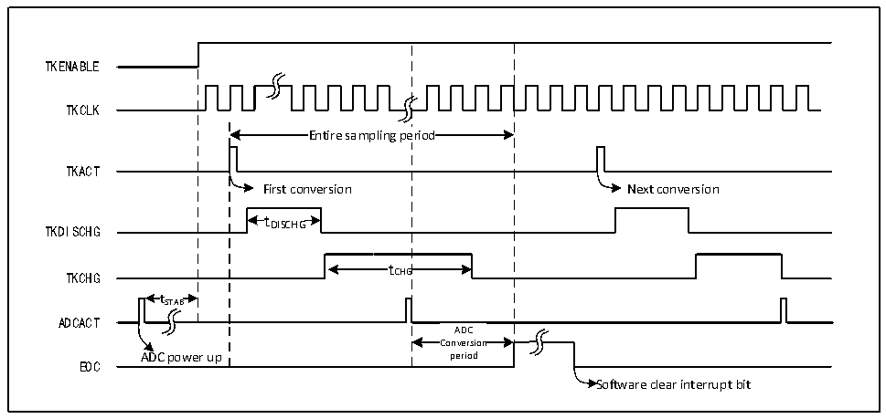

<!-- source-page: 126 -->

[← p.125](0125.md) · [index](../README.md) · [PDF p.126](https://ch32-riscv-ug.github.io/CH32L103/datasheet_zh/CH32L103RM.PDF#page=126) · [p.127 →](0127.md)

<!-- header: CH32L103应用手册 https://wch.cn -->

# 第 13 章 触摸按键检测（TKEY）

触摸检测控制（TKEY）单元，借助ADC模块的电压转换功能，通过将电容量转换为电压量进行  
采样，实现触摸按键检测功能。检测通道复用ADC的10个外部通道，通过ADC模块的单次转换模式  
实现触摸按键检测。  

## 13.1 TKEY 功能描述

● TKEY开启  
TKEY检测过程需要ADC模块配合进行，所以使用TKEY功能时，需要保证ADC模块处于上电状  
态（ADON=1），然后将ADC_CTLR1寄存器的TKENABLE位置1，打开TKEY单元功能，且可以通过TKITUNE  
位调整TKEY模块的充电电流。  
TKEY只支持单次单通道转换模式，将待转换的通道配置到ADC模块的规则组序列第一个，软件  
启动转换（写TKEY_ACT_DCG寄存器）。  
注：不进行TKEY转换时，仍然可以保留ADC通道配置转换功能。  

图13-1 TKEY工作时序图  
 <!-- rendered from the PDF; verify at https://ch32-riscv-ug.github.io/CH32L103/datasheet_zh/CH32L103RM.PDF#page=126 -->

🖼 Text parsed from the figure above

TKENABLE  
TKCLK  
Entire sampling pe  eriod  Entire sampling pe  eriod  
TKACT  
First conversion Next conversion  
t  
TKDISCHG DISCHG  
tCHG  tCHG  
TKCHG  
t  tSTAB  
ADCACT  
ADCConversion  Conversion period  
ADC power up period  
EOC  
Software clear interrupt bit  

● 可编程采样时间  
TKEY 单元转换需要先使用若干个 ADCCLK 时钟周期（tDISCHG）进行放电，然后再通过若干个  
ADCCLK 周期（tCHG）对通道进行充电进行电压采样，充电周期数为 ADC_SAMPTR2 寄存器中的  
SMPx[2:0]配置值加上TKEY_CHGOFFSET偏移量之和，每个通道可以分别用不同的充电周期来调整采  
样电压。  
● TKEY多路屏蔽  

<!-- p126-table-005 (table-12-5@1) -->
<table><tr><th></th><th>为控制通道总开关</th></tr><tr><td>单独控制每一路通道使能。</td><td></td></tr></table>

TKEY_DRV_EN 位在高电平下有效，置位时 TOUCHKEY 多路屏蔽使能，为控制通道总开关；  
TKEY_DRV_OUTEN位在高电平下有效，使能时进行单独控制每一路通道使能。  

## 13.2 TKEY 操作步骤

TKEY检测属于ADC模块下的扩展功能，其工作原理是通过“触摸”和“非触摸”方式让硬件通  
道感知的电容量发生变化，进而通过可设置的充放电周期数将电容量的变化转换为电压的变化，最  
后通过ADC模块转换为数字值。  
采样时，需要将ADC配置为单次单通道工作模式，由TKEY_ACT寄存器的“写操作”启动一次转  
<!-- image: p126-draw-image-00001 bbox=[507.84, 786.36, 527.28, 796.68] -->
<!-- footer: V2.2 121 -->
