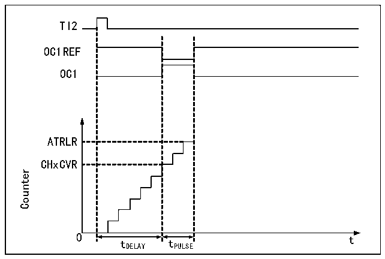

<!-- source-page: 138 -->

[← p.137](0137.md) · [index](../README.md) · [PDF p.138](https://ch32-riscv-ug.github.io/CH32L103/datasheet_zh/CH32L103RM.PDF#page=138) · [p.139 →](0139.md)

<!-- header: CH32L103应用手册 https://wch.cn -->

### 14.3.9 单脉冲模式

单脉冲模式可以用于让微控制器响应一个特定的事件，使之在一个延迟之后产生一个脉冲，延  
迟和脉冲的宽度可编程。置OPM位可以使核心计数器在产生下一个更新事件UEV时（计数器翻转到  
0）停止。  
如图14-5，需要在TI2输入引脚上检测到一个上升沿开始，延迟Tdelay之后，在OC1上产生  
一个长度为Tpulse的正脉冲：  

图14-5 单脉冲的产生  
 <!-- rendered from the PDF; verify at https://ch32-riscv-ug.github.io/CH32L103/datasheet_zh/CH32L103RM.PDF#page=138 -->

🖼 Text parsed from the figure above

TI2  
OC1REF  
OC1  
ATRLR  
CHxCVR  
Counter  
0 t  
tDELAY tPULSE  

1） 设定TI2为触发。置CC2S域为01b，把TI2FP2映射到TI2；置CC2P位为0b，TI2FP2设为上升  
沿检测；置TS域为110b，TI2FP2设为触发源；置SMS域为110b，TI2FP2被用来启动计数器；  
2） Tdelay由比较捕获寄存器的的值确定，Tpulse由自动重装值寄存器的值和比较捕获寄存器的值  
确定。  

### 14.3.10 编码器模式

编码器模式是定时器的一个典型应用，可以用来接入编码器的双相输出，核心计数器的计数方  
向和编码器的转轴方向同步，编码器每输出一个脉冲就会使核心计数器加一或减一。使用编码器的  
步骤为：将 SMS 域置为 001b（只在 TI2 边沿计数）、010b（只在 TI1 边沿计数）或 011b（在 TI1  
和TI2双边沿计数），将编码器接到比较捕获通道1、2的输入端，给重装值寄存器设一个值，这个  
值可以设的大一点。在编码器模式时，定时器内部的比较捕获寄存器，预分频器，重复计数寄存器  
等都正常工作。下表表明了计数方向和编码器信号的关系。  

<!-- p138-table-002 (table-14-1@1) -->
<table><caption>表14-1 定时器编码器模式的计数方向和编码器信号之间的关系</caption><tr><th rowspan="2">计数有效边沿</th><th rowspan="2" style="text-align:left">相对信号的电平</th><th colspan="2">TI1FP1信号边沿</th><th colspan="2">TI2FP2信号</th></tr><tr><td>上升沿</td><td>下降沿</td><td>上升沿</td><td>下降沿</td></tr><tr><td rowspan="2">仅在TI1边沿计数</td><td>高</td><td>向下计数</td><td>向上计数</td><td rowspan="2" colspan="2">不计数</td></tr><tr><td>低</td><td>向上计数</td><td>向下计数</td></tr><tr><td rowspan="2">仅在TI2边沿计数</td><td>高</td><td rowspan="2" colspan="2">不计数</td><td>向上计数</td><td>向下计数</td></tr><tr><td>低</td><td>向下计数</td><td>向上计数</td></tr><tr><td rowspan="2">在TI1和TI2双边沿计数</td><td>高</td><td>向下计数</td><td>向上计数</td><td>向上计数</td><td>向下计数</td></tr><tr><td>低</td><td>向上计数</td><td>向下计数</td><td>向下计数</td><td>向上计数</td></tr></table>

### 14.3.11 TIMx定时器和外部触发的同步

定时器能够在复位模式、门控模式和触发模式下和一个外部触发同步。  
<!-- image: p138-draw-image-00001 bbox=[507.84, 786.36, 527.28, 796.68] -->
<!-- footer: V2.2 133 -->
