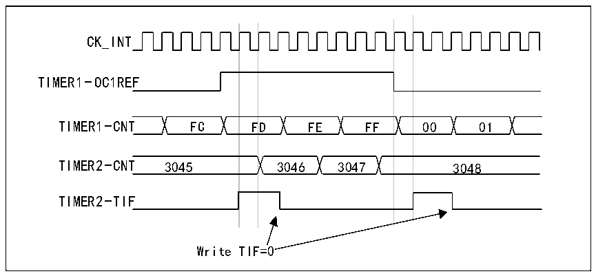

<!-- source-page: 142 -->

[← p.141](0141.md) · [index](../README.md) · [PDF p.142](https://ch32-riscv-ug.github.io/CH32L103/datasheet_zh/CH32L103RM.PDF#page=142) · [p.143 →](0143.md)

<!-- header: CH32L103应用手册 https://wch.cn -->
的计数器。  
使用一个定时器使能另一个定时器  
本例中通过定时器1的输出比较1来使能定时器2。仅当定时器1的OC1REF为高电平时，定时  
器2才根据分频后的内部时钟进行计数。两个计数器的时钟频率都基于CK_INT通过预分频器执行3  
分频(fCK_CNT=fCK_INT/3)。  
1) 将定时器 1 配置为主模式，发送其输出比较 1 参考信号(OC1REF)作为触发输出  
（R16_TIM1_CR2寄存器中的MMS=100）。  
2) 配置定时器1的OC1REF波形（R16_TIM1_CCMR1寄存器）。  
3) 配置定时器2以接收来自定时器1的输入触发（R16_TIM2_SMCFGR寄存器中的TS=000）。  
4) 将定时器2配置为门控模式（R16_TIM2_SMCFGR寄存器中的SMS=101）。  
5) 通过向CEN位（R16_TIM2_CTLR1寄存器）写入“1”使能定时器2。  
6) 通过向CEN位（R16_TIM1_CTLR1寄存器）写入“1”启动定时器1。  
注：计数器2的时钟与计数器1不同步，此模式仅影响定时器2的计数器使能信号。  

图14-11 使用定时器1的OC1REF对定时器2实施门控控制  
 <!-- rendered from the PDF; verify at https://ch32-riscv-ug.github.io/CH32L103/datasheet_zh/CH32L103RM.PDF#page=142 -->

🖼 Text parsed from the figure above

CK_INT  
F  D  
TIMER1-OC1REF  
TIMER2-TIF  
Write TIF=0  

定时器2的计数器和预分频器在启动前未进行初始化。因此从各自的当前值开始计数。启动定  
时器1之前，通过复位这两个定时器可以从指定值开始计数。这样便可以在定时器计数器中写入所  
需的任意值。两个定时器都可通过软件使用R16_TIMx_SWEVGR寄存器中的UG位轻松复位。  
在下一示例中，定时器1与定时器2同步。定时器1为主模式，从0开始计数。定时器2为从  
模式，从0xE7开始计数。两个定时器的预分频比相同。在R16_TIM1_CTLR1寄存器中通过向CEN位  
写入“0”来禁止定时器1时，定时器2将停止：  
1) 将定时器 1 配置为主模式，发送其输出比较 1 参考信号(OC1REF)作为触发输出  
（R16_TIM1_CTLR2寄存器中的MMS=100）。  
2) 配置定时器1的OC1REF波形（R16_TIM1_CHCTLR1寄存器）。  
3) 配置定时器2以接收来自定时器1的输入触发（R16_TIM2_SMCFGR寄存器中的TS=000）。  
4) 将定时器2配置为门控模式（R16_TIM2_SMCFGR寄存器中的SMS=101）。  
5) 通过向UG位（R16_TIM1_SWEVGR寄存器）写入“1”复位定时器1。  
6) 通过向UG位（R16_TIM2_SWEVGR寄存器）写入“1”复位定时器2。  
7) 通过在定时器2的计数器(R16_TIM2_CNTL)中写入“0xE7”使定时器2初始化为0xE7。  
8) 通过向CEN位（R16_TIM2_CTLR1寄存器）写入“1”使能定时器2。  
9) 通过向CEN位（R16_TIM1_CTLR1寄存器）写入“1”启动定时器1。  
10) 通过向CEN位（R16_TIM1_CTLR1寄存器）写入“0”停止定时器1。  
<!-- image: p142-draw-image-00001 bbox=[507.84, 786.36, 527.28, 796.68] -->
<!-- footer: V2.2 137 -->
