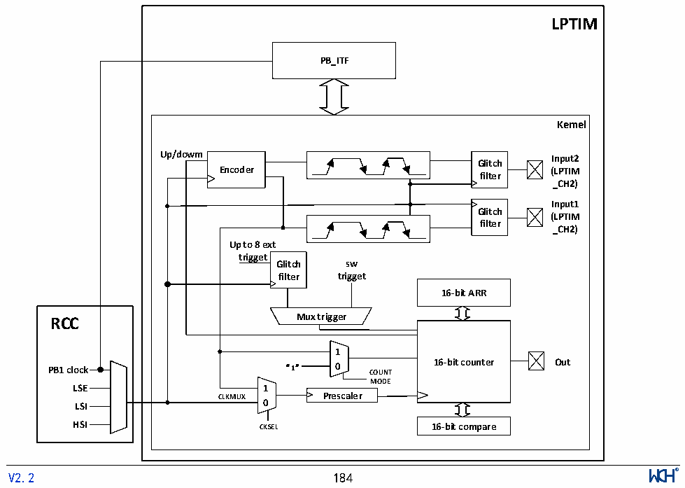

<!-- source-page: 189 -->

[← p.188](0188.md) · [index](../README.md) · [PDF p.189](https://ch32-riscv-ug.github.io/CH32L103/datasheet_zh/CH32L103RM.PDF#page=189) · [p.190 →](0190.md)

<!-- header: CH32L103应用手册 https://wch.cn -->

# 第 16 章 低功耗定时器（LPTIM）

<!-- p189-table-001 (table-15-5@1) -->
<table><tr><th style="text-align:left">LPTIM是一个16位上行计数的定时器。LPTIM具有多种可选的时钟源，使得LPTIM能在除待机</th></tr><tr><td style="text-align:left">模式外的所有电源模式下运行。LPTIM在没有内部时钟源的情况下也能运行，依此可以将LPTIM 当</td></tr><tr><td style="text-align:left">作“脉冲计数器”使用。除此之外，LPTIM还能将系统从低功耗模式唤醒，所以LPTIM很适合以极低的</td></tr><tr><td>功耗实现“超时功能”。</td></tr></table>

## 16.1 主要特征

● 16位上行计数器  
● 3位预分频器，支持8种分频系数（1、2、4、8、16、32、64、128）  
● 可选时钟源  
内部时钟源：LSE、LSI、HSI或PB1时钟  
外部时钟源：LPTIM输入上的外部时钟  
● 16位ARR自动重装载寄存器  
● 16位比较寄存器  
● 连续/单触发模式  
● 可选择的软件/硬件输入触发器  
● 可编程数字干扰滤波器  
● 可配置输出PWM波  
● 可配置I/O极性  
● 编码器模式  

## 16.2 LPTIM 功能描述

### 16.2.1 LPTIM框图

图16-1 低功耗定时器框图  
 <!-- rendered from the PDF; verify at https://ch32-riscv-ug.github.io/CH32L103/datasheet_zh/CH32L103RM.PDF#page=189 -->

🖼 Text parsed from the figure above

<strong>LPTIM</strong>  
<strong>PB_ITF</strong>  
<strong>Kemel</strong>  
<strong>Up/dowm Input2</strong>  
<strong>Glitch</strong>  
owm  
<strong>Encoder (LPTIM</strong>  
<strong>filter</strong>  
<strong>_CH2)</strong>  
<strong>Input1</strong>  
<strong>Glitch</strong>  
<strong>(LPTIM</strong>  
<strong>filter</strong>  
<strong>_CH2)</strong>  
<strong>Up to 8 ext</strong>  
<strong>trigget</strong>  
<strong>Glitch sw</strong>  
<strong>filter trigget</strong>  
<strong>16-bit ARR</strong>  
<strong>RCC Mux trigger</strong>  
<strong>1</strong>  
<strong>PB1 clock “1” 0 COUNT 16-bit counter Out</strong>  
<strong>MODE</strong>  
<strong>LSE 1</strong>  
<strong>CLKMUX Prescaler</strong>  
<strong>LSI 0</strong>  
<strong>HSI CKSEL 16-bit compare</strong>  
<!-- image: p189-draw-image-00001 inside the figure -->
<!-- footer: V2.2 184 -->

