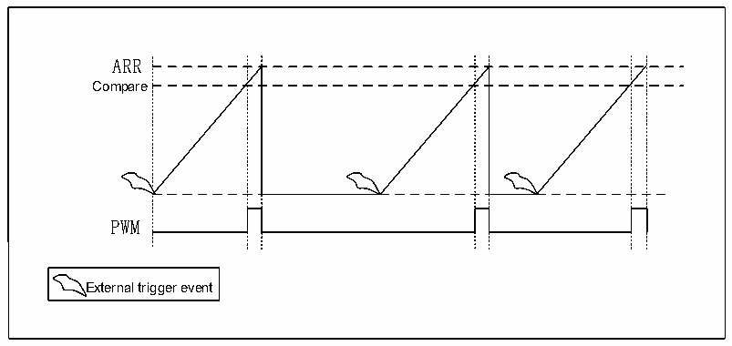
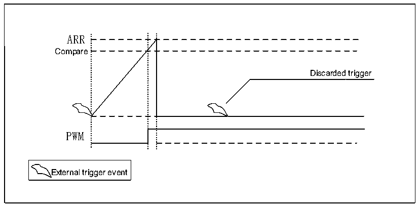
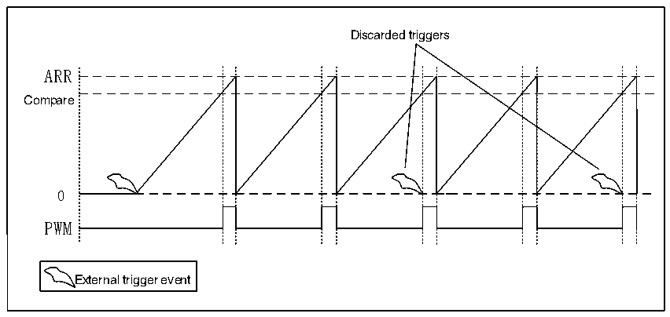

<!-- source-page: 192 -->

[← p.191](0191.md) · [index](../README.md) · [PDF p.192](https://ch32-riscv-ug.github.io/CH32L103/datasheet_zh/CH32L103RM.PDF#page=192) · [p.193 →](0193.md)

<!-- header: CH32L103应用手册 https://wch.cn -->

> ⬆ **Table continued** — rendered in full at [page 191](0191.md). <!-- p192-table-001 -->

### 16.3.5 操作模式

LPTIM具有两种操作模式：  
连续模式：计时器自由运行，从触发事件启动，直到计时器被禁用才停止。  
单触发模式：计时器从触发事件启动，当达到ARR值时停止。  
在单触发模式中，要启用单次计数，必须将 SNGSTRT 位置 1，一个新的触发事件将重新启动计  
时器，在计数器启动之后至计数器达到ARR之前发生的任何触发事件都将被丢失。  
在选择用外部触发时，则在置位SNGSTRT位后以及计数器寄存器停止后到达的每个外部触发器  
事件将启动计数器进行新的一次计数循环。  

图16-3 单次计数模式配置时的LPTIM输出波形  
 <!-- rendered from the PDF; verify at https://ch32-riscv-ug.github.io/CH32L103/datasheet_zh/CH32L103RM.PDF#page=192 -->

🖼 Text parsed from the figure above

ARR  
Compare  
PWM  
External trigger event  

激活单触发设置模式，应该注意的是，在单触发模式下，当LPTIMx_CFGR寄存器中的WAVE位字  
段被设置时，一次设置模式被激活。在这种情况下，计数器仅在第一个触发后启动一次，任何后续  
的触发事件均被丢弃。  

图16-4 单次计数模式配置且激活一次设置模式时的LPTIM输出波形  
 <!-- rendered from the PDF; verify at https://ch32-riscv-ug.github.io/CH32L103/datasheet_zh/CH32L103RM.PDF#page=192 -->

🖼 Text parsed from the figure above

ARR  
Compare  
Discarded trigger  
PWM  
External trigger event  

连续模式，要启用连续计数，必须设置CNTSTRT位，如果选择了外部触发器，则在设置CNTSTRT  
之后到达的外部触发器事件将启动计数器进行连续计数。任何后续的外部触发事件都将被丢弃，在  
软件启动的情况下（TRIGEN=00）设置CNTSTRT将启动计数器连续计数。  

图16-5 连续计数模式配置时的LPTIM输出波形  
 <!-- rendered from the PDF; verify at https://ch32-riscv-ug.github.io/CH32L103/datasheet_zh/CH32L103RM.PDF#page=192 -->

<!-- image: p192-draw-image-00001 bbox=[507.84, 786.36, 527.28, 796.68] -->
<!-- footer: V2.2 187 -->
