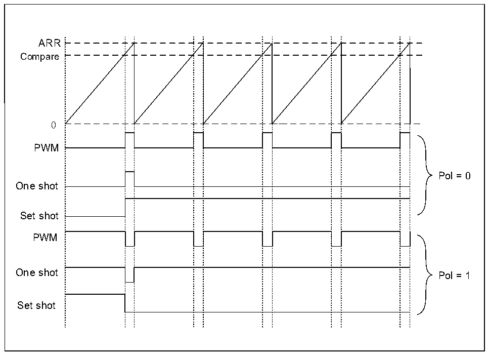

<!-- source-page: 193 -->

[← p.192](0192.md) · [index](../README.md) · [PDF p.193](https://ch32-riscv-ug.github.io/CH32L103/datasheet_zh/CH32L103RM.PDF#page=193) · [p.194 →](0194.md)

<!-- header: CH32L103应用手册 https://wch.cn -->

🖼 Text parsed from the figure above

Discarded triggers  
ARR  
Compare  
0  
PWM  
External trigger event  

SNGSTRT和CNTSTRT位只能在定时器启用时设置（ENABLE位设置为1），可以将更改LPTIM计  
数器模式，如果先前选择了连续模式，则设置SNGSTRT将把LPTIM切换到单触发模式，计数器达到  
ARR 值停止计数，如果先前选择了单触发模式，则设置 CNTSTRT会将 LPTIM切换到连续模式。计数  
器达到ARR值时立即重新启动。  

### 16.3.6 超时功能

在一个选定的触发输入上检测到有效边沿可用于重置计数器，此功能通过TIMOUT位进行控制。  
第一个触发事件将启动计数器，任何连续的触发事件都将重置计数器并且计时器将重新启动，可以  
实现低功耗超时功能，如果没有触发事件发生，则MCU被比较匹配事件唤醒。  

### 16.3.7 波形产生

两个16位寄存器LPTIM_ARR和LPTIM_CMP，用于在LPTIM输出上生成几个不同的波形。  
计时器可以生成以下波形：  
（1） PWM模式：一旦LPTIM_CNT中的计数器值超过LPTIM_CMP中的比较值，就设置LPTIM输出。  
一旦LPTIM_ARR和LPTIM_CNT寄存器值相等，LPTIM输出就会重置。  
（2） 单脉冲模式：输出波形与第一个脉冲的PWM模式相似，然后永久复位。  
（3） 一次设置模式：输出波形与单脉冲模式相似，只是输出保持在最后一个信号电平（取决于输  
出配置的极性）。  
上述模式要求LPTIM_ARR寄存器值严格大于LPTIM_CMP寄存器值。  
LPTIM输出波形可以通过WAVE位配置如下：  
（1） 将WAVE位重置为0将强制LPTIM生成PWM波形或单脉冲波形，具体取决于设置的位：CNTSTRT  
或SNGSTRT。  
（2） 将WAVE位设置为1将强制LPTIM生成一次设置模式。  
WAVPOL位控制LPTIM输出极性，更改会立即生效，因此在重新配置极性后，甚至在启用计时器  
之前，输出默认值也会立即更改。  
生成的信号的频率高达LPTIM时钟频率2分频。图16-6给出了可能在LPTIM输出上生成的三种  
波形。此外，此图还显示了通过WAVPOL位更改极性所产生的效果。  

图16-6 生成波形  
 <!-- rendered from the PDF; verify at https://ch32-riscv-ug.github.io/CH32L103/datasheet_zh/CH32L103RM.PDF#page=193 -->

<!-- image: p193-draw-image-00001 bbox=[507.84, 786.36, 527.28, 796.68] -->
<!-- footer: V2.2 188 -->
