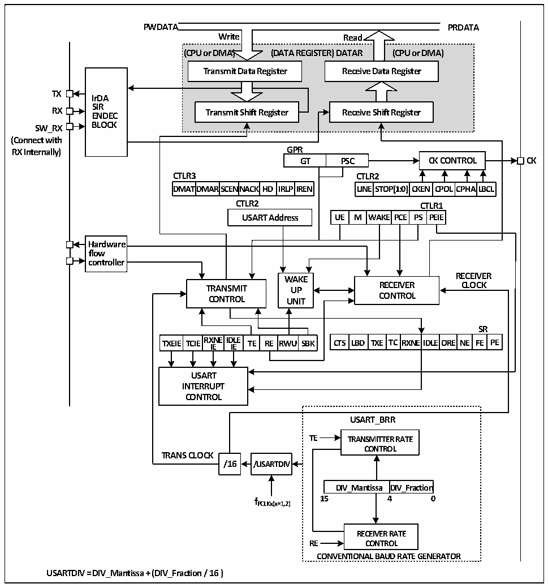

<!-- source-page: 205 -->

[← p.204](0204.md) · [index](../README.md) · [PDF p.205](https://ch32-riscv-ug.github.io/CH32L103/datasheet_zh/CH32L103RM.PDF#page=205) · [p.206 →](0206.md)

<!-- header: CH32L103应用手册 https://wch.cn -->

## 17.2 概述

图17-1 通用同步/异步收发器的结构框图  
 <!-- rendered from the PDF; verify at https://ch32-riscv-ug.github.io/CH32L103/datasheet_zh/CH32L103RM.PDF#page=205 -->

🖼 Text parsed from the figure above

<strong>PWDATA PRDATA</strong>  
<!-- image: p205-draw-image-00005 inside the figure -->
<!-- image: p205-draw-image-00004 inside the figure -->
<strong>Write Read</strong>  
<strong>(CPU or DMA) (DATA REGISTER) DATAR (CPU or DMA)</strong>  
<strong>Transmit Data Register Receive Data Register</strong>  
<!-- image: p205-draw-image-00003 inside the figure -->
<!-- image: p205-draw-image-00006 inside the figure -->
<strong>TX</strong>  
<strong>IrDA</strong>  
<strong>SIR</strong>  
<strong>RX Transmit Shift Register Receive Shift Register</strong>  
<strong>ENDEC</strong>  
<strong>SW_RX BLOCK</strong>  
<strong>(Connect with</strong>  
<strong>RX Internally) GPR</strong>  
<strong>GT PSC CK CONTROL CK</strong>  
<strong>CTLR3 CTLR2</strong>  
DMAT  TDMAR  SCENN  NACK  HD  IRLP  
CLITNLER2ST  TOP[1:0]  CKEN  CPOL  CPHA  ALBCL  
<strong>DMATDMARSCENNACKHD IRLPIREN LINESTOP[1:0]CKEN CPOLCPHALBCL</strong>  
<strong>CTLR2 CTLR1</strong>  
M  WA  AKE PCE  CTLR PS PE  R1EIE  
Hardware flow controller  
<!-- image: p205-draw-image-00002 inside the figure -->
<strong>WWAAKKEE RECEIVER</strong>  
<strong>TRANSMIT UUPP RECEIVER CLOCK</strong>  
<strong>CONTROL UUNNIITT CONTROL</strong>  
<strong>SR</strong>  
TXEIE  TCIE  RXNE IIE  IDLEIE  TE  RE  RWU  
LBD  TXE  TC  RXNE  EIDLE  EORE  NE  SRFE  RPE  
<strong>TXEIE TCIERX IE NE ID IE LE TE RE RWU SBK CTS LBD TXE TCRXNEIDLEORE NE FE PE</strong>  
<strong>USART</strong>  
<strong>INTERRUPT</strong>  
<strong>CONTROL</strong>  
<strong>USART_BRR</strong>  
<strong>TE TRANSMITTER RATE</strong>  
<strong>CONTROL</strong>  
<strong>TRANS CLOCK</strong>  
<strong>/16 /USARTDIV</strong>  
DIV_Mantissa  DIV_Fraction  
<strong>f 15 4 0</strong>  
<strong>PCLKx(x=1,2)</strong>  
<strong>RECEIVER RATE</strong>  
<strong>RE CONTROL</strong>  
<strong>CONVENTIONAL BAUD RATE GENERATOR</strong>  
<strong>USARTDIV = DIV_Mantissa + (DIV_Fraction / 16 )</strong>  

当TE（发送使能位）置位时，发送移位寄存器里的数据在TX引脚上输出，时钟在CK引脚上输  
出。在发送时，最先移出的是最低有效位，每个数据帧都由一个低电平的起始位开始，然后发送器  
根据 M（字长）位上的设置发送八位或九位的数据字，最后是数目可配置的停止位。如果配有奇偶  
检验位，数据字的最后一位为校验位。在TE置位后会发送一个空闲帧，空闲帧是10位或11位高电  
平，包含停止位。断开帧是10位或11位低电平，后跟着停止位。  

## 17.3 波特率发生器

收发器的波特率 = FCLK/(16*USARTDIV)，FCLK是PBx的时钟，即PCLK1或PCLK2， USART1模  
块使用PCLK2，其余的使用PCLK1。USARTDIV的值是根据USART_BRR中的DIV_M和DIV_F两个域决  
定的，具体计算的公式为：  
<!-- image: p205-draw-image-00001 bbox=[507.84, 786.36, 527.28, 796.68] -->
<!-- footer: V2.2 200 -->
