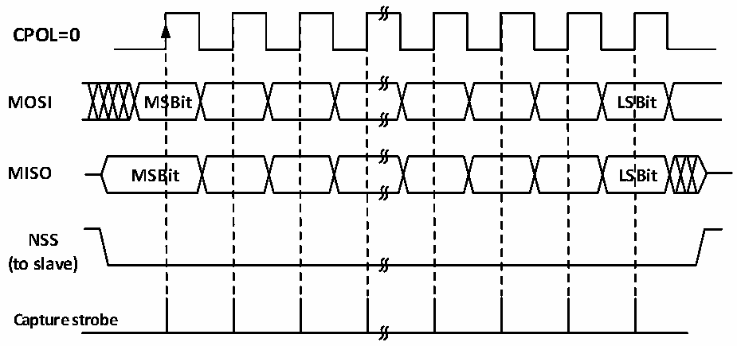
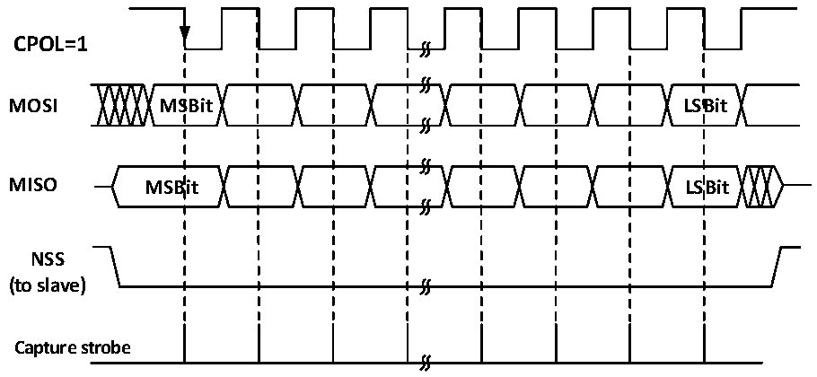

<!-- source-page: 233 -->

[← p.232](0232.md) · [index](../README.md) · [PDF p.233](https://ch32-riscv-ug.github.io/CH32L103/datasheet_zh/CH32L103RM.PDF#page=233) · [p.234 →](0234.md)

<!-- header: CH32L103应用手册 https://wch.cn -->

图19-2 SPI主模式读写模式0  
 <!-- rendered from the PDF; verify at https://ch32-riscv-ug.github.io/CH32L103/datasheet_zh/CH32L103RM.PDF#page=233 -->

# MODE 0

# CPHA=0

🖼 Text parsed from the figure above

<strong>CPOL=0</strong>  
<strong>MOSI MSBit LSBit</strong>  
<strong>MISO MSBit LSBit</strong>  
<strong>NSS</strong>  
<strong>(to slave)</strong>  
<strong>Capture strobe</strong>  

图19-3 SPI主模式读写模式1  
 <!-- rendered from the PDF; verify at https://ch32-riscv-ug.github.io/CH32L103/datasheet_zh/CH32L103RM.PDF#page=233 -->

<strong>MODE 1</strong>  
<strong>CPHA=0</strong>  

🖼 Text parsed from the figure above

<strong>CPOL=1</strong>  
<strong>MOSI MSBit LSBit</strong>  
<strong>MISO MSBit LSBit</strong>  
<strong>NSS</strong>  
<strong>(to slave)</strong>  
<strong>Capture strobe</strong>  

<!-- image: p233-draw-image-00001 bbox=[507.84, 786.36, 527.28, 796.68] -->
<!-- footer: V2.2 228 -->
