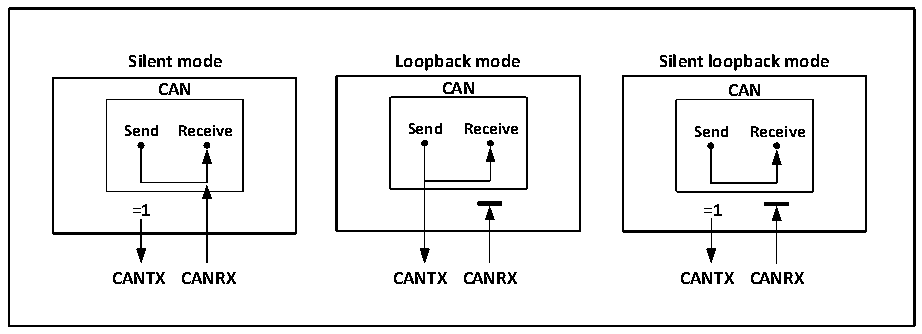

<!-- source-page: 267 -->

[← p.266](0266.md) · [index](../README.md) · [PDF p.267](https://ch32-riscv-ug.github.io/CH32L103/datasheet_zh/CH32L103RM.PDF#page=267) · [p.268 →](0268.md)

<!-- header: CH32L103应用手册 https://wch.cn -->

图22-2 CAN总线的三种测试模式  
 <!-- rendered from the PDF; verify at https://ch32-riscv-ug.github.io/CH32L103/datasheet_zh/CH32L103RM.PDF#page=267 -->

🖼 Text parsed from the figure above

<strong>Silent mode Loopback mode Silent loopback mode</strong>  
<strong>CAN CAN CAN</strong>  
<strong>Send Receive Send Receive Send Receive</strong>  
<strong>=1 =1</strong>  
<strong>CANTX CANRX CANTX CANRX CANTX CANRX</strong>  

## 22.4 MCU 处于调试模式下 CAN 控制器的工作状态

当MCU进入调试模式后，内核处于暂停状态，但可以通过调试模块中配置位来决定CAN控制器  
是处于正常运行或停止状态。  

## 22.5 CAN 控制器功能描述

### 22.5.1 发送处理流程

发送处理流程如下：如果三个发送邮箱中有空置的邮箱，应用层软件仅对空置邮箱的寄存器具  
有写入权限，对寄存器CAN1_TXMIRx、CAN1_TXMDTRx、CAN1_TXMDLRx和CAN1_TXMDHRx进行操作，可  
以设置报文标识符、报文长度、时间戳和报文数据等。在数据准备好之后，对寄存器 CAN1_TXMIRx  
的TXRQ位置1请求发送，邮箱进入挂号状态，并进行优先级排队；一旦成为最高优先级邮箱，则变  
为预定发送状态，等待CAN总线空闲；当CAN总线空闲时，预定发送邮箱的报文立刻进入发送状态；  
报文发送完毕后，邮箱重新成为空置邮箱，并且寄存器CAN1_TSTATR的RQCP和TXOK位置1，来指  
示发送成功；若发送时仲裁失败，寄存器CAN1_TSTATR的ALST位置1，若发送错误，则TERR位置1。  

### 22.5.2 发送优先级

发送优先级可以由标识符或发送请求先后次序决定，寄存器CAN1_CTLR的TXFP位置1按发送请  
求先后次序发送，按发送请求先后次序主要应用于分段发送；TXFP位清0按标识符优先级决定发送  
次序，标识符越小则优先级越高，同标识符的情况下，则低编号的邮箱有更高优先级。  

### 22.5.3 发送中止处理

若对寄存器CAN1_TSTATR的ABRQ位置1，则可以中止发送请求。当邮箱状态为挂号或预定发送  
状态时，发送请求直接中止；当邮箱处于发送状态时，中止请求可能会成功（停止发送），也有可  
能会失败（发送完成），结果可由寄存器CAN1_TSTATR的TXOK位来查询。  

### 22.5.4 基于时间触发模式

传统的CAN通信总线繁忙时，容易造成低优先级的消息长时间阻塞，甚至无法满足其时限的要  
求。为了解决该瓶颈，推出了基于时间触发模式的相关协议，此类协议在工业上有一定规模的应用，  
基于时间触发模式的功能即为配合此类协议的应用。  
在时间触发模式下有两种模式可供选择，使用该模式需关闭自动重传功能，通过配置  
CAN1_TTCTLR寄存器的MODE位来选择默认模式和增强模式。对寄存器CAN1_CTLR的TTCM和NART位  
置 1，使能时间触发模式并禁止自动重传，CAN1_TTCTLR 寄存器的MODE 位默认为 0，此时工作在默  
认模式，内部定时器被激活用来产生发送和接收邮箱的时间戳，定时器在CAN位时间累加，内部定  
<!-- image: p267-draw-image-00001 bbox=[507.84, 786.36, 527.28, 796.68] -->
<!-- footer: V2.2 262 -->
