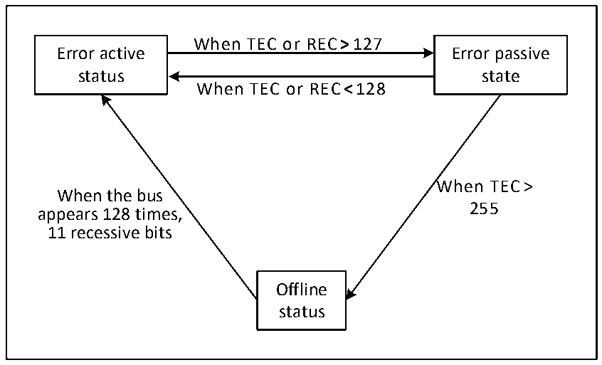

<!-- source-page: 269 -->

[← p.268](0268.md) · [index](../README.md) · [PDF p.269](https://ch32-riscv-ug.github.io/CH32L103/datasheet_zh/CH32L103RM.PDF#page=269) · [p.270 →](0270.md)

<!-- header: CH32L103应用手册 https://wch.cn -->
当总线监测到128次出现11个连续的隐性位时，恢复到错误主动状态，该恢复方式受主控制寄  
存器CAN1_CTLR里的ABOM位影响。若ABOM置1，则硬件自动退出离线状态。若ABOM为0，则需要  
软件操作INRQ位进入初识化模式，随后退出初始化，才能退出离线状态。  

图22-4 CAN错误状态切换图  
 <!-- rendered from the PDF; verify at https://ch32-riscv-ug.github.io/CH32L103/datasheet_zh/CH32L103RM.PDF#page=269 -->

🖼 Text parsed from the figure above

When TEC or REC&gt;127  
Error active Error passive  
status state  
When TEC or REC&lt;128  
When TEC&gt;  
When the bus  
255  
appears 128 times,  
11 recessive bits  
Offline  
status  

### 22.5.7 位时序

按照CAN总线的标准，将每一位时间分为四段：分别为同步段、传播时间段、相位缓冲段1和  
相位缓冲段2。这些段由最小时间单元Tq组成。CAN控制器通过采样来监测CAN总线变化，通过帧  
起始位的边沿进行同步  
CAN控制器把上述四段重新划分为三段，分别为：  
● 同步段(SS)：也就是CAN标准里的同步段，固定为1个最小时间单元，正常情况下所期望的位  
跳变发生在本时间段内。  
● 时间段1(BS1)：包含CAN标准里的传播时间段和相位缓冲段1，可以被设置为包含1到16最小  
时间单元，可以被自动延长，用于补偿CAN总线上不同节点频率精度误差带来的相位正向漂移。该  
时间段结束为采样点位置。  
● 时间段2(BS2)：也就是CAN标准里的相位缓冲段2，可以被设置为1到8个最小时间单元，可  
以被自动缩短，以补偿CAN总线上不同节点频率精度误差带来的相位负向漂移。  
重新同步跳转宽度(SJW)，是每位中可以延长和缩小的最小时间单元数量上限，范围可设置为1  
到4个最小时间单元。  
上述参数都可以在CAN总线时序寄存器CAN1_BTIMR里配置。  
<!-- image: p269-draw-image-00001 bbox=[507.84, 786.36, 527.28, 796.68] -->
<!-- footer: V2.2 264 -->
