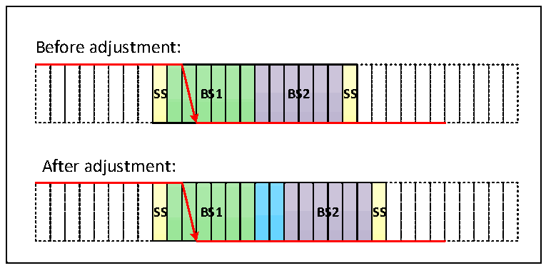
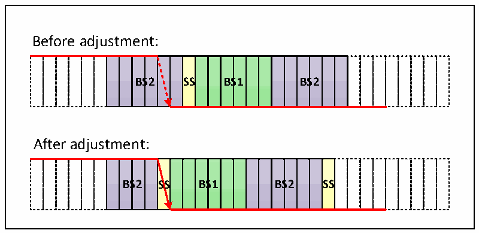

<!-- source-page: 270 -->

[← p.269](0269.md) · [index](../README.md) · [PDF p.270](https://ch32-riscv-ug.github.io/CH32L103/datasheet_zh/CH32L103RM.PDF#page=270) · [p.271 →](0271.md)

<!-- header: CH32L103应用手册 https://wch.cn -->

图22-5 跳变出现在BS1中  
 <!-- rendered from the PDF; verify at https://ch32-riscv-ug.github.io/CH32L103/datasheet_zh/CH32L103RM.PDF#page=270 -->

🖼 Text parsed from the figure above

Before adjustment:  
<!-- image: p270-draw-image-00002 inside the figure -->
<!-- image: p270-draw-image-00003 inside the figure -->
<!-- image: p270-draw-image-00004 inside the figure -->
<!-- image: p270-draw-image-00005 inside the figure -->
<!-- image: p270-draw-image-00015 inside the figure -->
<!-- image: p270-draw-image-00006 inside the figure -->
<!-- image: p270-draw-image-00007 inside the figure -->
<!-- image: p270-draw-image-00008 inside the figure -->
<!-- image: p270-draw-image-00009 inside the figure -->
<!-- image: p270-draw-image-00010 inside the figure -->
<!-- image: p270-draw-image-00011 inside the figure -->
<!-- image: p270-draw-image-00012 inside the figure -->
<!-- image: p270-draw-image-00013 inside the figure -->
<!-- image: p270-draw-image-00014 inside the figure -->
SS  S  BS  S1  BS  S2  SS  
After adjustment:  
<!-- image: p270-draw-image-00016 inside the figure -->
<!-- image: p270-draw-image-00017 inside the figure -->
<!-- image: p270-draw-image-00018 inside the figure -->
<!-- image: p270-draw-image-00019 inside the figure -->
<!-- image: p270-draw-image-00029 inside the figure -->
<!-- image: p270-draw-image-00020 inside the figure -->
<!-- image: p270-draw-image-00021 inside the figure -->
<!-- image: p270-draw-image-00022 inside the figure -->
<!-- image: p270-draw-image-00023 inside the figure -->
<!-- image: p270-draw-image-00024 inside the figure -->
<!-- image: p270-draw-image-00025 inside the figure -->
<!-- image: p270-draw-image-00026 inside the figure -->
<!-- image: p270-draw-image-00027 inside the figure -->
<!-- image: p270-draw-image-00028 inside the figure -->
<!-- image: p270-draw-image-00030 inside the figure -->
<!-- image: p270-draw-image-00031 inside the figure -->
SS  S  BS  S1  BS  S2  SS  

如图22-5，SJW为2，总线电平跳变在时间段1被检测到，则需要延长时间段1的长度，最大  
延长SJW，从而延迟采样点的位置。  

图22-6 跳变出现在BS2中  
 <!-- rendered from the PDF; verify at https://ch32-riscv-ug.github.io/CH32L103/datasheet_zh/CH32L103RM.PDF#page=270 -->

🖼 Text parsed from the figure above

Before adjustment:  
<!-- image: p270-draw-image-00032 inside the figure -->
<!-- image: p270-draw-image-00033 inside the figure -->
<!-- image: p270-draw-image-00034 inside the figure -->
<!-- image: p270-draw-image-00035 inside the figure -->
<!-- image: p270-draw-image-00036 inside the figure -->
<!-- image: p270-draw-image-00037 inside the figure -->
<!-- image: p270-draw-image-00047 inside the figure -->
<!-- image: p270-draw-image-00038 inside the figure -->
<!-- image: p270-draw-image-00039 inside the figure -->
<!-- image: p270-draw-image-00040 inside the figure -->
<!-- image: p270-draw-image-00041 inside the figure -->
<!-- image: p270-draw-image-00042 inside the figure -->
<!-- image: p270-draw-image-00043 inside the figure -->
<!-- image: p270-draw-image-00044 inside the figure -->
<!-- image: p270-draw-image-00045 inside the figure -->
<!-- image: p270-draw-image-00046 inside the figure -->
<!-- image: p270-draw-image-00048 inside the figure -->
<!-- image: p270-draw-image-00049 inside the figure -->
<!-- image: p270-draw-image-00050 inside the figure -->
BS  S2  SS  BS  S1  BS  S2  
After adjustment:  
<!-- image: p270-draw-image-00051 inside the figure -->
<!-- image: p270-draw-image-00052 inside the figure -->
<!-- image: p270-draw-image-00053 inside the figure -->
<!-- image: p270-draw-image-00054 inside the figure -->
<!-- image: p270-draw-image-00055 inside the figure -->
<!-- image: p270-draw-image-00056 inside the figure -->
<!-- image: p270-draw-image-00066 inside the figure -->
<!-- image: p270-draw-image-00057 inside the figure -->
<!-- image: p270-draw-image-00058 inside the figure -->
<!-- image: p270-draw-image-00059 inside the figure -->
<!-- image: p270-draw-image-00060 inside the figure -->
<!-- image: p270-draw-image-00061 inside the figure -->
<!-- image: p270-draw-image-00062 inside the figure -->
<!-- image: p270-draw-image-00063 inside the figure -->
<!-- image: p270-draw-image-00064 inside the figure -->
<!-- image: p270-draw-image-00065 inside the figure -->
<!-- image: p270-draw-image-00067 inside the figure -->
<!-- image: p270-draw-image-00068 inside the figure -->
BS  S2  SS  BS  S1  BS  S2  SS  S  

如图22-6，SJW为2，总线电平跳变在时间段2被检测到，则需要缩小时间段2的长度，最大  
缩小SJW，从而提前采样点的位置。  

## 22.6 CAN 中断

CAN控制器有3个中断向量，分别为发送中断、FIFO_0中断、错误及状态变化中断。  
设置CAN中断允许寄存器CAN1_INTENR，可以允许或禁用各个中断源。  
发送中断由发送邮箱变空事件产生，中断产生后，查询寄存器 CAN1_TSTATR 的 RQCP0、RQCP1  
和RQCP2位来判断是哪个邮箱变空事件产生。  
FIFO0中断由接收新报文、接收邮箱变满和溢出事件产生，中断产生后，查询寄存器CAN1_RFIFO0  
的FMP0、FULL0和FOVER0位来判断是哪个邮箱变空事件产生。  
错误及状态变化中断由出错、唤醒和睡眠事件产生。  
<!-- image: p270-draw-image-00001 bbox=[507.84, 786.36, 527.28, 796.68] -->
<!-- footer: V2.2 265 -->
