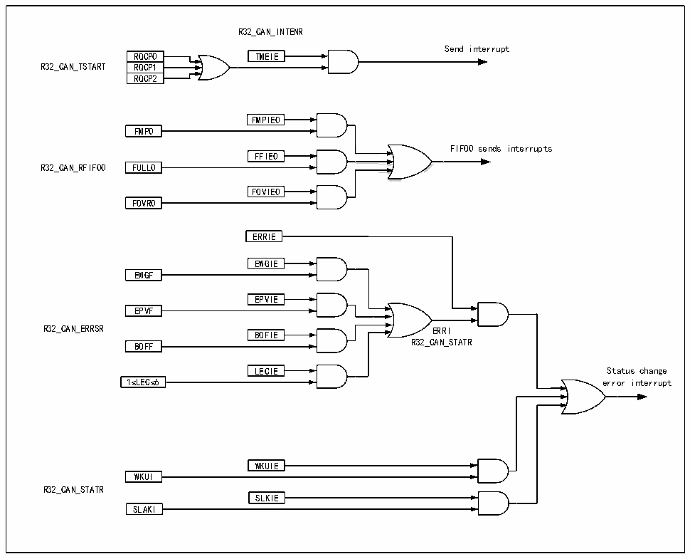

<!-- source-page: 271 -->

[← p.270](0270.md) · [index](../README.md) · [PDF p.271](https://ch32-riscv-ug.github.io/CH32L103/datasheet_zh/CH32L103RM.PDF#page=271) · [p.272 →](0272.md)

<!-- header: CH32L103应用手册 https://wch.cn -->

图22-7 CAN中断逻辑图  
 <!-- rendered from the PDF; verify at https://ch32-riscv-ug.github.io/CH32L103/datasheet_zh/CH32L103RM.PDF#page=271 -->

🖼 Text parsed from the figure above

R32_CAN_INTENR  
Send interrupt  
RQCP0  RQCP1  RQCP2  
RQCP0 TMEIE  
R32_CAN_TSTART RQCP1  
FMPIE0  
<!-- image: p271-draw-image-00002 inside the figure -->
FMP0  
FIFO0 sends interrupts  
FFIE0  
R32_CAN_RFIF00 FULL0  
FOVIE0  
FOVR0  
ERRIE  
EWGIE  
EWGF  
<!-- image: p271-draw-image-00004 inside the figure -->
EPVIE  
EPVF  
<!-- image: p271-draw-image-00003 inside the figure -->
R32_CAN_ERRSR ERRI  
<!-- image: p271-draw-image-00005 inside the figure -->
BOFIE  
BOFF R32_CAN_STATR  
<!-- image: p271-draw-image-00006 inside the figure -->
LECIE  
LECIE Status change  
1≤LEC≤6 error interrupt  
WKUIE  
WKUI  
R32_CAN_STATR  
SLKIE  
SLAKI  

## 22.7 CAN FD 功能说明

### 22.7.1 FD帧操作

1）FD帧的发送：  
只需将 CANFD_CR 寄存器的[7:0]位配置为 0x0F，同时将对应邮箱的 CANFD_DMA_T0/1/2 缓冲区  
填入发送数据，并且配置DMA地址，即可发出FD格式的帧，其他寄存器按需配置即可。  
2）FD帧的接收：  
只需配置对应接收FIFO的CANFD_DMA_R0地址，并将CANFD_BTR寄存器配置为正确的比特率，  
即可接收到FD帧。  
在FDCAN格式中，DLC的编码与标准CAN格式有所不同。其中DLC代码0至8的编码与标准CAN  
相同，而代码9至15（在标准CAN中均编码一个8字节的数据字段）的编码与标准CAN不同，如表  
所示。  

<!-- p271-table-003 (table-22-1@1) -->
<table><caption>表22-1 CAN FD模式下的DLC编码</caption><tr><th>DLC</th><th>9</th><th>10</th><th>11</th><th>12</th><th>13</th><th>14</th><th>15</th></tr><tr><td style="text-align:left">数据字节数</td><td>12</td><td>16</td><td>20</td><td>24</td><td>32</td><td>48</td><td>64</td></tr></table>

注：当接收数据长度（DLC）小于等于8字节时，接收的数据将会被存在RXMDLR0、RXMDLR0中。当  
接收长度大于8字节时，接收的数据将会由DMA搬运至DNA_R0指向的RAM地址。FD帧接收FIFO深  
度为1，也即每次接收到数据后，软件必须及时取走接收到的的数据包，否则数据会被覆盖。  
<!-- image: p271-draw-image-00001 bbox=[507.84, 786.36, 527.28, 796.68] -->
<!-- footer: V2.2 266 -->
