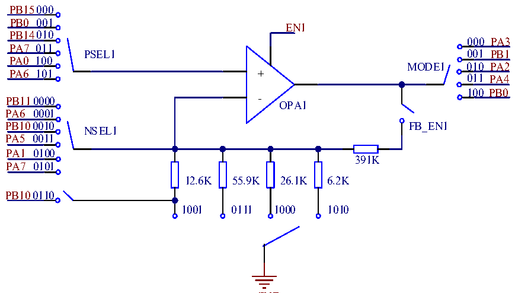

<!-- source-page: 289 -->

[← p.288](0288.md) · [index](../README.md) · [PDF p.289](https://ch32-riscv-ug.github.io/CH32L103/datasheet_zh/CH32L103RM.PDF#page=289) · [p.290 →](0290.md)

<!-- header: CH32L103应用手册 https://wch.cn -->

# 第 23 章 运放（OPA）和比较器（CMP）

该模块包含1个可独立配置的运算放大器（OPA或PGA）和3个可独立配置的电压比较器（CMP），  
其中运算放大器（OPA或PGA）支持增益选择，也可改用于电压比较器。  
每个运算放大器的输入和输出均连接至I/O口，且输入引脚或增益可选择，输出引脚可选择配  
置到通用I/O口或复用为ADC采样通道的I/O，支持将外部模拟小信号放大送入ADC以实现小信号  
ADC转换。  
每个电压比较器的输入和输出均连接至I/O口，且输入引脚可选择，输出引脚可选择配置到通  
用I/O口或复用为TIM内部采样通道（不占用I/O引脚）。  

## 23.1 主要特性

● OPA输入引脚或通道可选择  
● OPA输出引脚可选择通用I/O口或ADC采样通道  
● OPA支持正端输入轮询功能  
● OPA支持PGA增益选择  
● CMP输入引脚可选择，负端输入通道可选公用引脚  
● CMP输出引脚可选择通用I/O口或TIM内部采样通道  
● OPA中断可使系统从睡眠模式中唤醒  
● CMP中断可使系统从睡眠和停止模式中唤醒  

## 23.2 功能描述

### 23.2.1 运放 OPA

置位OPA_CTLR1寄存器中的EN1，即可使能对应的OPA1，配置OPA_CTLR1寄存器中的MODE1可  
选择OPA1的输出通道为ADC采样通道或者普通I/O口，配置OPA_CTLR1寄存器中的PSEL1，可选择  
OPA1的正端输入引脚，配置OPA_CTLR1寄存器中的NSEL1，可选择OPA1的负端输入通道、或作为  
PGA使用时的增益。  

图23-1 OPA结构图  
 <!-- rendered from the PDF; verify at https://ch32-riscv-ug.github.io/CH32L103/datasheet_zh/CH32L103RM.PDF#page=289 -->

🖼 Text parsed from the figure above

PB15000  
PB0 001  
EN1  
PB14010  
000 PA3  
PA7 011  
PSEL1 001 PB1  
PA0 100  
MODE1 010 PA2  
PA6 101 +  
011 PA4  
100 PB0  
PB110000 -  
OPA1  
PA6 0001  
PB100010 FB_EN1  
NSEL1  
PA5 0011  
PA1 0100  
391K  
PA7 0101  
12.6K 55.9K 26.1K 6.2K  
PB100110  
1001 0111 1000 1010  

GND  
<!-- image: p289-draw-image-00001 bbox=[507.84, 786.36, 527.28, 796.68] -->
<!-- footer: V2.2 284 -->
